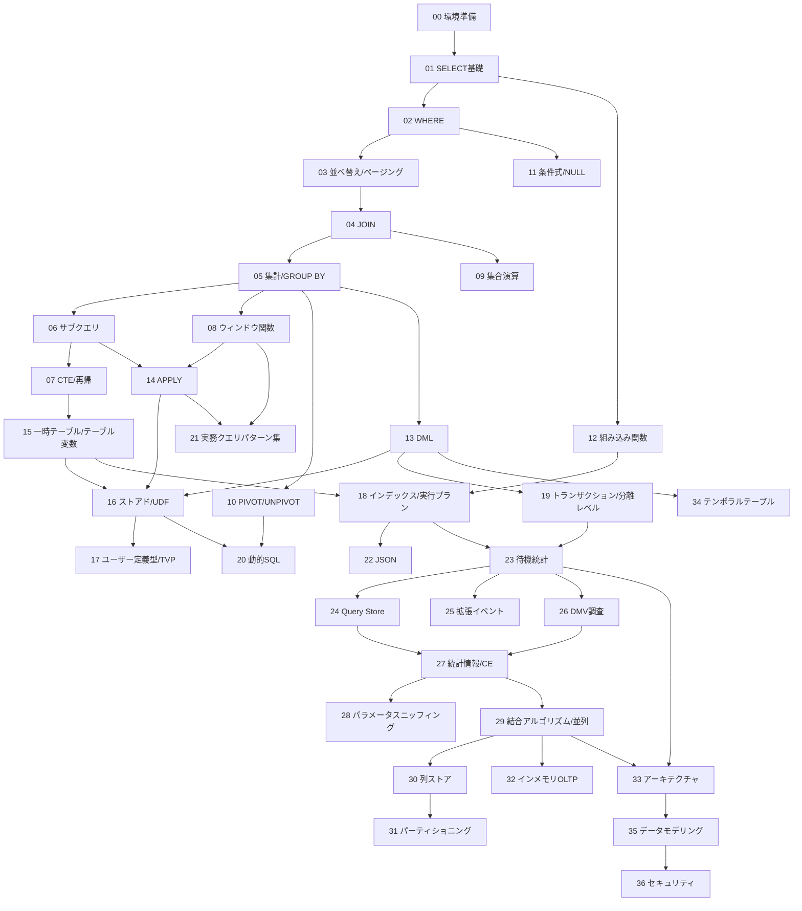

# 学習ロードマップ

T-SQL のクエリ力を「読める」→「書ける」→「使いこなせる」へ引き上げるための
段階的カリキュラムです。上から順に進めることを推奨します。
各トピックを終えたらチェックを入れていきましょう。

## 進め方の目安

- 1トピック = **解説を読む(20〜40分)＋演習を解く(30〜60分)** が目安。
- 演習は **まず自力で書く** → 動かして結果を確認 → `solutions/` と照合、の順で。
- 解答例と違っても、**同じ結果集合が正しく求まっていれば正解** です。
  SQL は書き方が一通りではありません。別解を思いついたらメモしておきましょう。

## チェックリスト

### レベル 0 – 準備
- [ ] **00 環境準備** — SQL Server / SSMS or Azure Data Studio の用意、サンプルDB構築

### レベル 1 – 基礎(単一テーブルを読む)
- [ ] **01 SELECT の基礎** — 列の選択・別名・`DISTINCT`・リテラル・計算列
- [ ] **02 WHERE による絞り込み** — 比較・`AND/OR/NOT`・`BETWEEN`/`IN`/`LIKE`・NULL判定
- [ ] **03 並べ替えとページング** — `ORDER BY`・`TOP`・`OFFSET-FETCH`

> **到達目標**: 1つのテーブルから「欲しい行・欲しい列・欲しい順序」を自在に取り出せる。

### レベル 2 – 結合と集計(複数テーブル・要約)
- [ ] **04 テーブル結合 (JOIN)** — `INNER/LEFT/RIGHT/FULL/CROSS`・自己結合・多段結合
- [ ] **05 集計とグループ化** — 集約関数・`GROUP BY`・`HAVING`・`ROLLUP`/`CUBE`/`GROUPING SETS`

> **到達目標**: 複数テーブルを正しく結合し、グループ単位の集計値を求められる。
> NULL と外部結合の相互作用を理解している。

### レベル 3 – 応用(問い合わせを組み合わせる)
- [ ] **06 サブクエリ** — スカラー/複数行/相関サブクエリ・`EXISTS`/`IN`/`ANY`/`ALL`
- [ ] **07 共通表式 (CTE) と再帰** — `WITH`・可読性の改善・再帰CTEによる階層展開

> **到達目標**: 問い合わせを部品に分解して段階的に組み立てられる。
> 相関サブクエリと再帰CTEの動作を説明できる。

### レベル 4 – 分析(高度な集計・整形)
- [ ] **08 ウィンドウ関数** — `OVER`・`ROW_NUMBER/RANK/DENSE_RANK`・移動集計・`LAG/LEAD`・フレーム
- [ ] **09 集合演算** — `UNION`/`UNION ALL`/`INTERSECT`/`EXCEPT`
- [ ] **10 PIVOT / UNPIVOT** — 行↔列の変換・条件付き集計によるクロス集計

> **到達目標**: グループを崩さずに順位・累計・前後比較を計算でき、
> クロス集計表を作れる。

### レベル 5 – 式・関数・データ操作
- [ ] **11 条件式と NULL 処理** — `CASE`・`COALESCE`/`ISNULL`/`NULLIF`/`IIF`/`CHOOSE`
- [ ] **12 組み込み関数** — 文字列・日付/時刻・数値・変換(`CAST`/`CONVERT`/`TRY_CONVERT`)
- [ ] **13 データ操作 (DML)** — `INSERT`/`UPDATE`/`DELETE`/`MERGE`・`OUTPUT`句・トランザクション基礎

> **到達目標**: 値の変換・整形・条件分岐を式レベルで扱え、
> 安全にデータを更新できる。

---

ここまでが「**クエリをどう書くか**」(言語仕様)。
ここから先は「**実務でどう組み立て、どう速くするか**」に進みます。

### レベル 6 – 実務の道具立て
- [ ] **14 APPLY (CROSS / OUTER)** — JOINでは書けない相関、グループごとTOP N、TVFとの組み合わせ
- [ ] **15 一時テーブルとテーブル変数** — `#temp`/`@table`/CTE の使い分け、統計情報の有無が性能を分ける理由
- [ ] **16 ストアドプロシージャと UDF** — パラメータ・OUTPUT・TRY-CATCH、スカラーUDFが遅い理由とiTVF
- [ ] **17 ユーザー定義型と TVP** — テーブル型で複数行をまとめてプロシージャに渡す実務の定番

> **到達目標**: 中間結果の持ち方を根拠をもって選べる。
> 処理を部品化し、複数行をまとめて受け渡すプロシージャを書ける。

### レベル 7 – 性能
- [ ] **18 インデックスと実行プラン** — Seek/Scan、Key Lookup、カバリングインデックス、**SARGability**
- [ ] **19 トランザクションと分離レベル** — 4つの分離レベル、`NOLOCK`の実害、デッドロック

> **到達目標**: 実行プランを読んで遅い原因を特定でき、
> 「同じ結果でも書き方でコストが変わる」を説明できる。
> ※ このレベルは `sample-db/03_bulk_data.sql`(100万行)の実行が前提です。

### レベル 8 – 発展
- [ ] **20 動的SQL** — `sp_executesql`、インジェクション対策、動的PIVOT
- [ ] **21 実務頻出クエリパターン集** — グループごと最新行、重複削除、ギャップ&アイランド、番号表
- [ ] **22 JSON操作** — `OPENJSON` / `FOR JSON` / `JSON_VALUE`、計算列＋インデックス

> **到達目標**: 要件を見たときに「あのパターンだ」と手が動く。

---

ここまでで「**強い実務者**」です。ここから先は方向が変わります。
**書ける機能を増やすのではなく、「なぜそうなるか」を説明し、原因を特定して直せる**ようになる段階です。

> 上級編で一貫して求められる姿勢は3つです。
> 1. **推測しない、計測する** — 「たぶん遅い」ではなく、待機統計とDMVで特定する
> 2. **説明できる** — 「なぜオプティマイザはこのプランを選んだか」を統計情報から言える
> 3. **一次情報にあたる** — 公式ドキュメント、実行プランXML、DMVの実際の値

### レベル 9 – 診断(最大の分水嶺)
- [ ] **23 待機統計とボトルネック特定** — 「CPUかIOかロックかメモリか」を切り分ける方法論
- [ ] **24 Query Store** — プラン履歴の永続化、リグレッション検出、プラン強制
- [ ] **25 拡張イベント** — 遅いクエリ・デッドロック・ブロッキングの捕捉と解析
- [ ] **26 DMVによる調査** — 調査クエリの武器庫。欠落インデックス提案を鵜呑みにしない判断力

> **到達目標**: 「本番が遅い」と言われたとき、**手順を持って原因に到達できる**。
> ※ 23・25・26 は `sample-db/05_workload.sql` で負荷をかけながら進めます
> (待機は同時実行がないと発生しません)。

### レベル 10 – オプティマイザ内部
- [ ] **27 統計情報とカーディナリティ推定** — ヒストグラムを読み、推定が外れる機序を説明できる
- [ ] **28 パラメータスニッフィング詳解** — 「昨日まで速かったのに」の正体と対策の全体像
- [ ] **29 結合アルゴリズムと並列処理** — Loops/Merge/Hash の選択理由、メモリ許可とスピル

> **到達目標**: 実行プランを見て「なぜこうなったか」を説明でき、
> 対策の副作用まで含めて選べる。

### レベル 11 – 大規模データの構造
- [ ] **30 列ストアとバッチモード** — 分析系で桁を変える。セグメント除外が効く条件
- [ ] **31 パーティショニング** — 目的は性能ではなく運用性。スイッチによる瞬時の入替
- [ ] **32 インメモリOLTP** — ロックを使わない同時実行制御。銀の弾丸ではない前提で

> **到達目標**: データ量が2桁増えても通用する物理構造を選べる。
> ※ 30・31 は `sample-db/04_analytics_data.sql`(1000万行)が前提です。

### レベル 12 – 土台
- [ ] **33 SQL Serverアーキテクチャ** — ページ/バッファプール/WAL/tempdb競合。全現象の説明原理
- [ ] **34 テンポラルテーブルと履歴設計** — 履歴要件の標準解と、代替案との比較
- [ ] **35 データモデリングと物理設計** — **設計が性能の上限を決める**。制約は最適化情報でもある
- [ ] **36 セキュリティ機能** — RLS、動的データマスク、Always Encrypted の脅威モデル

> **到達目標**: 観測した現象を内部構造から説明でき、
> 「そもそもこの設計でよいのか」を判断できる。

---

## ここから先(教材の外)

36章を終えたら、教材で伸ばせる範囲はほぼ終わりです。ここから先は:

- **公式ドキュメントを一次情報として読む** — Microsoft Learn の SQL Server ドキュメント。
  DMVやオプションの正確な仕様は必ずここで確認する
- **自分の環境で測る** — 本記載の数値はすべて目安。バージョン・ハードウェア・データ分布で変わる
- **他人の遅いクエリを直す** — 実際の問題ほど良い教材はない
- **バージョンごとの変更を追う** — CE の変更、Adaptive Query Processing、PSP最適化など、
  プランに関わる挙動はバージョンで変わる

## 前提知識の依存関係

## 学習のコツ

- **実行計画を眺める習慣** — SSMS の「実際の実行プラン」を表示すると、
  同じ結果でも書き方でコストが変わることが体感できます(中級以降)。
- **NULL を常に疑う** — 期待と違う結果の大半は NULL 絡みです。
  「この列に NULL はあり得るか?」を毎回自問しましょう。
- **結果件数を予想してから実行** — 実行前に「何行返るはず」と予想する癖が、
  結合ミス(行の重複・欠落)の早期発見につながります。
