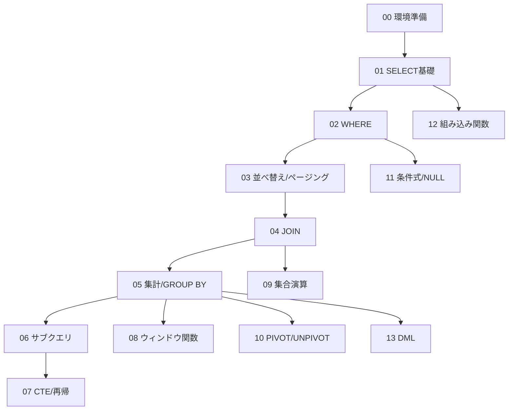

# 学習ロードマップ

T-SQL のクエリ力を「読める」→「書ける」→「使いこなせる」へ引き上げるための
段階的カリキュラムです。上から順に進めることを推奨します。
各トピックを終えたらチェックを入れていきましょう。

## 進め方の目安

- 1トピック = **解説を読む(20〜40分)＋演習を解く(30〜60分)** が目安。
- 演習は **まず自力で書く** → 動かして結果を確認 → `solutions/` と照合、の順で。
- 解答例と違っても、**同じ結果集合が正しく求まっていれば正解** です。
  SQL は書き方が一通りではありません。別解を思いついたらメモしておきましょう。

## チェックリスト

### レベル 0 – 準備
- [ ] **00 環境準備** — SQL Server / SSMS or Azure Data Studio の用意、サンプルDB構築

### レベル 1 – 基礎(単一テーブルを読む)
- [ ] **01 SELECT の基礎** — 列の選択・別名・`DISTINCT`・リテラル・計算列
- [ ] **02 WHERE による絞り込み** — 比較・`AND/OR/NOT`・`BETWEEN`/`IN`/`LIKE`・NULL判定
- [ ] **03 並べ替えとページング** — `ORDER BY`・`TOP`・`OFFSET-FETCH`

> **到達目標**: 1つのテーブルから「欲しい行・欲しい列・欲しい順序」を自在に取り出せる。

### レベル 2 – 結合と集計(複数テーブル・要約)
- [ ] **04 テーブル結合 (JOIN)** — `INNER/LEFT/RIGHT/FULL/CROSS`・自己結合・多段結合
- [ ] **05 集計とグループ化** — 集約関数・`GROUP BY`・`HAVING`・`ROLLUP`/`CUBE`/`GROUPING SETS`

> **到達目標**: 複数テーブルを正しく結合し、グループ単位の集計値を求められる。
> NULL と外部結合の相互作用を理解している。

### レベル 3 – 応用(問い合わせを組み合わせる)
- [ ] **06 サブクエリ** — スカラー/複数行/相関サブクエリ・`EXISTS`/`IN`/`ANY`/`ALL`
- [ ] **07 共通表式 (CTE) と再帰** — `WITH`・可読性の改善・再帰CTEによる階層展開

> **到達目標**: 問い合わせを部品に分解して段階的に組み立てられる。
> 相関サブクエリと再帰CTEの動作を説明できる。

### レベル 4 – 分析(高度な集計・整形)
- [ ] **08 ウィンドウ関数** — `OVER`・`ROW_NUMBER/RANK/DENSE_RANK`・移動集計・`LAG/LEAD`・フレーム
- [ ] **09 集合演算** — `UNION`/`UNION ALL`/`INTERSECT`/`EXCEPT`
- [ ] **10 PIVOT / UNPIVOT** — 行↔列の変換・条件付き集計によるクロス集計

> **到達目標**: グループを崩さずに順位・累計・前後比較を計算でき、
> クロス集計表を作れる。

### レベル 5 – 式・関数・データ操作
- [ ] **11 条件式と NULL 処理** — `CASE`・`COALESCE`/`ISNULL`/`NULLIF`/`IIF`/`CHOOSE`
- [ ] **12 組み込み関数** — 文字列・日付/時刻・数値・変換(`CAST`/`CONVERT`/`TRY_CONVERT`)
- [ ] **13 データ操作 (DML)** — `INSERT`/`UPDATE`/`DELETE`/`MERGE`・`OUTPUT`句・トランザクション基礎

> **到達目標**: 値の変換・整形・条件分岐を式レベルで扱え、
> 安全にデータを更新できる。

## 前提知識の依存関係

## 学習のコツ

- **実行計画を眺める習慣** — SSMS の「実際の実行プラン」を表示すると、
  同じ結果でも書き方でコストが変わることが体感できます(中級以降)。
- **NULL を常に疑う** — 期待と違う結果の大半は NULL 絡みです。
  「この列に NULL はあり得るか?」を毎回自問しましょう。
- **結果件数を予想してから実行** — 実行前に「何行返るはず」と予想する癖が、
  結合ミス(行の重複・欠落)の早期発見につながります。
