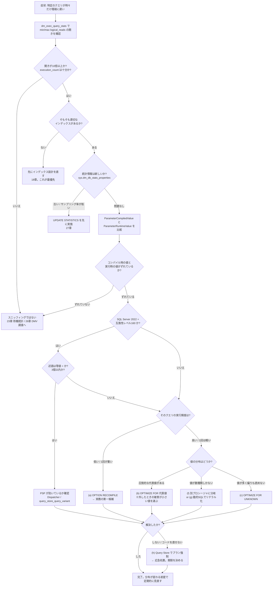

# 28 パラメータスニッフィング詳解

> **このトピックのゴール**: 「**昨日まで速かったのに今日から遅い**」という
> 本番障害で最も頻出する症状の正体を、**再現・検出・対処**の3段階で扱えるようになる。
> パラメータスニッフィングを **悪者ではなく「通常は有益な最適化」** として正しく位置づけ、
> 9通りの対策とその **副作用** を比較したうえで、
> 「まず何を試すか」を自分で判断できるようになる。
>
> **前提**: [27 統計情報とカーディナリティ推定](27_statistics_cardinality.md) を済ませ、
> ヒストグラム・密度ベクター・推定行数の読み方を理解していること。
> [18 インデックスと実行プラン](18_indexes_execution_plans.md) の実行プランの読み方、
> [16 ストアドプロシージャとユーザー定義関数](16_stored_procedures.md) 第10節の
> スニッフィングの概説を前提とします。
>
> **この章は `sample-db/03_bulk_data.sql` を実行して `dbo.OrdersBig`(100万行)を
> 作成済みであることが前提**です。

すべての例は先頭で `USE SalesLearning;` を実行済みとします。

> ⚠️ **この章は「オブジェクトを作る」章です**
> インデックスとストアドプロシージャを作成します。
> 最後の第14節に **後片付けスクリプト**があります。必ず実行してから次の章へ進んでください。

---

## 1. パラメータスニッフィングとは何か — まず「悪ではない」を押さえる

SQL Server はパラメータ付きのクエリ(ストアドプロシージャ、`sp_executesql`、
パラメータ化されたアプリのクエリ)を **初めて実行するとき**に、次のことをします。

1. そのとき渡された **実際のパラメータ値を覗き見る (sniff)**。
2. その値でヒストグラムを引き、**行数を正確に見積もる**。
3. その見積もりに最適な実行プランをコンパイルし、**プランキャッシュに格納する**。
4. **2回目以降は、どんな値で呼ばれても同じプランを再利用する**。

ここで重要なのは、**1〜3 は明確に「良いこと」** だという点です。

```sql
-- スニッフィングが有効なケース: 値からヒストグラムを引けるので推定が正確になる
CREATE OR ALTER PROCEDURE dbo.usp_SniffDemo
    @OrderDate DATE
AS
BEGIN
    SET NOCOUNT ON;
    SELECT COUNT(*) AS 件数
    FROM   dbo.OrdersBig
    WHERE  OrderDate = @OrderDate;
END;
GO

EXEC dbo.usp_SniffDemo @OrderDate = '2023-06-01';
```

もしスニッフィングが無ければ、オプティマイザは「`@OrderDate` の中身は分からない」として
**密度ベクターによる平均的な推定**しか使えません([27 統計情報とカーディナリティ推定](27_statistics_cardinality.md))。
つまり **スニッフィングを止めると、ほぼ全てのクエリで推定精度が落ちます**。

> ⚠️ **「スニッフィングを無効化する」は解決策ではありません。**
> 「1つの遅いクエリを直すために、他の全クエリの推定を悪化させる」取引になります。
> 問題の本質は **スニッフィングそのもの**ではなく、
> **「1つのプランを、分布が大きく違う全ての値で使い回す」** という**プラン再利用**の側にあります。

### 問題が起きる条件は3つそろったとき

| 条件 | 説明 |
|---|---|
| ① **値の分布に偏りがある** | `Status` が 95% `N'完了'` / 5% `N'保留'` のような列 |
| ② **偏りによって最適なプランの「形」が変わる** | 少数行なら Seek + Key Lookup、大量行ならスキャン |
| ③ **同じプランが複数の値で再利用される** | プロシージャ / パラメータ化クエリ |

3つそろって初めて障害になります。逆に言えば、
**どれか1つを崩すのが対策**です(第9節の (a)〜(i) は、すべてこの3つのどれかを崩しています)。

## 2. 再現実験の準備

`dbo.OrdersBig`(100万行、`Status` は `N'完了'` 95% / `N'保留'` 5%)を使います。

```sql
-- 分布を確認しておく(あとで「なぜこうなるか」を説明するのに必要)
SELECT Status, COUNT(*) AS 行数,
       CAST(100.0 * COUNT(*) / SUM(COUNT(*)) OVER () AS DECIMAL(5,2)) AS 割合
FROM   dbo.OrdersBig
GROUP  BY Status;
```

| Status | 行数 | 割合 |
|---|---|---|
| 完了 | 約 950,000 | 約 95.00 |
| 保留 | 約 50,000 | 約 5.00 |

インデックスを1本作ります(この章の主役)。

```sql
CREATE NONCLUSTERED INDEX IX_OrdersBig_Status_OrderDate
    ON dbo.OrdersBig (Status, OrderDate);
GO
```

- `Amount` は **インデックスに含まれていません**。
  そのため `SUM(Amount)` を求めるには **Key Lookup(キー参照)** が必要になります。
  これが「少数行なら安い / 大量行なら破滅的」という非対称性を生みます。

検証対象のプロシージャです。

```sql
CREATE OR ALTER PROCEDURE dbo.usp_StatusSummary
    @Status NVARCHAR(10),
    @From   DATE
AS
BEGIN
    SET NOCOUNT ON;

    SELECT COUNT(*)        AS 件数,
           SUM(o.Amount)   AS 合計金額,
           AVG(o.Amount)   AS 平均金額
    FROM   dbo.OrdersBig AS o
    WHERE  o.Status    = @Status
      AND  o.OrderDate >= @From;
END;
GO
```

計測の準備をします。

```sql
SET STATISTICS IO   ON;
SET STATISTICS TIME ON;
-- SSMS では「実際の実行プランを含める」(Ctrl+M)も有効にしておく
```

> ⚠️ **`DBCC DROPCLEANBUFFERS` は使いません。**
> バッファプールを空にする操作は **インスタンス全体に影響**し、本番では厳禁です。
> この章の比較は **論理読み取り数 (logical reads)** で行います。
> 論理読み取り数はバッファの状態に依存しないため、**キャッシュを消さなくても公平に比較できます**。

## 3. 実験A — 少数側(`N'保留'`)で先にコンパイルさせる

まずプランキャッシュを初期状態に戻します(**安全な方法は第4節で詳説**します)。

```sql
EXEC sys.sp_recompile N'dbo.usp_StatusSummary';   -- このプロシージャのプランだけ無効化
GO
```

### ステップ1 — 少数側で初回実行

```sql
-- 2024年12月の「保留」だけ。実際は 400 行程度
EXEC dbo.usp_StatusSummary @Status = N'保留', @From = '2024-12-01';
```

実行プランを見ると、次の形になっているはずです。

```
  Index Seek (IX_OrdersBig_Status_OrderDate)  ─┐
                                               ├─ Nested Loops ─ Stream Aggregate ─ SELECT
  Key Lookup (PK_OrdersBig)                   ─┘
```

`SET STATISTICS IO` の出力(**環境により前後する目安**):

```
テーブル 'OrdersBig'。スキャン カウント 1、論理読み取り数 1300、...
```

- 400 行 × Key Lookup 3〜4 ページ + Seek 数ページ ≒ **1,300 程度**。
- 全件スキャン(約 6,000 ページ)より **明らかに安い**ので、
  オプティマイザのこの選択は **正しい**。ここまでは何も問題ありません。

### ステップ2 — 同じプランのまま大多数側を呼ぶ

```sql
-- 全期間の「完了」。実際は 950,000 行
EXEC dbo.usp_StatusSummary @Status = N'完了', @From = '2015-01-01';
```

`SET STATISTICS IO` の出力(**目安**):

```
テーブル 'OrdersBig'。スキャン カウント 1、論理読み取り数 2900000、...
```

- **論理読み取り数が約 300万** に跳ね上がります。
  950,000 行それぞれに Key Lookup が走るためです。
- 本来この値なら **Clustered Index Scan(約 6,000 読み取り)** が最適でした。
  つまり **約 500 倍の無駄**をしていることになります。

実際の実行プラン上では、次の3つが同時に観測できます。

1. **推定行数と実際の行数の乖離**
   Index Seek の推定行数は 400 程度なのに、実際は 950,000。
2. **Key Lookup の実行回数が 950,000 回**
   (演算子のプロパティ `実際の実行数 (Number of Executions)`)。
3. **ルート演算子のプロパティに残る「コンパイル時の値」**
   → 第6節で詳しく扱います。

> ⚠️ ここが本章の核心です。**プラン自体は「間違って」いません。**
> `N'保留' + 2024-12-01` に対しては最適なプランです。
> 間違っているのは **「その最適プランを `N'完了' + 全期間` にも適用してしまった」** ことです。

### ステップ3 — もし正しくコンパイルされていたら?

キャッシュを書き換えずに「その値に最適なプラン」を1回だけ試せます。

```sql
-- WITH RECOMPILE: この実行のためだけにコンパイルし、結果のプランはキャッシュしない
EXEC dbo.usp_StatusSummary @Status = N'完了', @From = '2015-01-01' WITH RECOMPILE;
```

今度は **Clustered Index Scan** が選ばれ、論理読み取り数は **約 6,000** に落ちます。
`WITH RECOMPILE` はキャッシュ内のプランを置き換えないので、
**「本来どのくらい速いはずなのか」を安全に測る**のに最適な手段です。

## 4. 実験B — 逆順(大多数側が先)を試す

プランを捨ててから、今度は **`N'完了'` を先に**実行します。

```sql
EXEC sys.sp_recompile N'dbo.usp_StatusSummary';
GO

-- ① 大多数側で初回実行 → Clustered Index Scan がキャッシュされる
EXEC dbo.usp_StatusSummary @Status = N'完了', @From = '2015-01-01';
-- 論理読み取り数 約 6,000

-- ② 少数側を同じプランで実行
EXEC dbo.usp_StatusSummary @Status = N'保留', @From = '2024-12-01';
-- 論理読み取り数 約 6,000(本来なら 1,300 で済む)
```

結果を並べると、**どちらが先かで結末がまるで違う**ことが分かります。

| 先にコンパイルされた値 | `N'保留'` 呼び出しの読み取り | `N'完了'` 呼び出しの読み取り | 最悪の劣化 |
|---|---|---|---|
| `N'保留'`(少数)が先 | 約 1,300(最適) | **約 2,900,000** | **約 500 倍** |
| `N'完了'`(大多数)が先 | 約 6,000 | 約 6,000(最適) | 約 5 倍 |

> ⚠️ **被害は対称ではありません。**
> この題材では「**大多数側でコンパイルされるほうが圧倒的に安全**」です。
> スキャンは「遅いが行数に比例して破綻はしない」プランであるのに対し、
> Key Lookup は「行数が増えると爆発する」プランだからです。
>
> **どちらの値が「安全側」かはデータとプラン形状ごとに違います。**
> だからこそ、対策 (b) `OPTIMIZE FOR` で **どの値を代表値にするか**は、
> 「一番よく使う値」ではなく **「外したときの被害が小さい値」** で選ぶのが定石になります。

### なぜ `Status` 単体では再現しないのか — ティッピングポイント

上の実験でわざわざ `@From`(日付の下限)を組み合わせたのには理由があります。
`WHERE Status = @Status` **だけ**にすると、`N'保留'` でも **50,000 行**あり、
Key Lookup 50,000 回のコストは全件スキャンより高くなるため、
**オプティマイザは `N'保留'` でもスキャンを選びます**(=プラン形状が変わらない)。

Key Lookup が全件スキャンに負ける境目を **ティッピングポイント (tipping point)** と呼びます。
経験則として、境目は **テーブルのページ数の 25〜33% 程度の行数**です。

- `dbo.OrdersBig` は約 6,000 ページ → 境目は **おおよそ 1,500〜2,000 行**。
- 100万行に対して 1,500 行は **0.15% 程度**。

> ⚠️ **「5% しか該当しないからインデックスが効くはず」は成り立ちません。**
> Key Lookup を伴う Seek が有利なのは、実務上 **1% を大きく下回る**選択率のときだけです。
> だからこそ、5% と 95% の差より **0.04% と 95% の差**のほうがずっと危険なのです。
> 検証時は「自分のデータのどこに境目があるか」を必ず実測してください。

## 5. プランキャッシュを安全にリセットする方法

再現実験でも障害対応でも、**プランを捨てる操作**が必要になります。
影響範囲が **狭い順**に並べると次のとおりです。**上から順に検討してください。**

| # | 手段 | 影響範囲 | バージョン |
|---|---|---|---|
| 1 | `EXEC dbo.usp_X ... WITH RECOMPILE` | **その1回の実行のみ**(キャッシュは変更しない) | すべて |
| 2 | `EXEC sys.sp_recompile N'dbo.usp_X'` | **そのオブジェクトのプランのみ** | すべて |
| 3 | `DBCC FREEPROCCACHE (plan_handle)` | **その1プランのみ** | すべて |
| 4 | `ALTER DATABASE SCOPED CONFIGURATION CLEAR PROCEDURE_CACHE;` | **そのデータベースのみ** | 2016+ |
| 5 | `DBCC FREEPROCCACHE;` | **インスタンス全体** ← **本番厳禁** | すべて |

```sql
-- ① 1回だけ別プランで試す(最も安全。診断の第一手)
EXEC dbo.usp_StatusSummary @Status = N'完了', @From = '2015-01-01' WITH RECOMPILE;

-- ② 特定オブジェクトのプランだけを次回実行時に作り直させる
EXEC sys.sp_recompile N'dbo.usp_StatusSummary';

-- ③ 特定のプランだけを捨てる(plan_handle を調べてから)
SELECT qs.plan_handle, qs.execution_count, OBJECT_NAME(qp.objectid, qp.dbid) AS オブジェクト
FROM   sys.dm_exec_query_stats AS qs
CROSS  APPLY sys.dm_exec_query_plan(qs.plan_handle) AS qp
WHERE  OBJECT_NAME(qp.objectid, qp.dbid) = N'usp_StatusSummary';

DBCC FREEPROCCACHE (0x0500...);      -- ↑で得た plan_handle を貼り付ける

-- ④ このデータベースのプランキャッシュだけを消す(SQL Server 2016 以降)
ALTER DATABASE SCOPED CONFIGURATION CLEAR PROCEDURE_CACHE;
```

> ⚠️ **`DBCC FREEPROCCACHE;`(引数なし)は本番環境で絶対に実行しないこと。**
> インスタンス上の **全データベース・全アプリケーションのプランが一斉に消えます**。
> 直後に「すべてのクエリが同時にコンパイルを要求する」状態になり、
> **CPU 100% と `RESOURCE_SEMAPHORE_QUERY_COMPILE` 待機**でシステム全体が停止しかねません
> ([23 待機統計とボトルネック特定](23_wait_statistics.md))。
> **「とりあえずキャッシュをクリア」は障害を拡大させる典型的な悪手**です。
> 学習環境でも、④のデータベーススコープ版か②の `sp_recompile` を使う習慣をつけてください。

- **`sp_recompile`** は対象オブジェクトに **スキーマ変更ロック (Sch-M)** を一瞬取ります。
  実行中のクエリがあると待たされる(=ブロッキングになる)点だけ注意してください。
  引数にテーブル名を渡すと、**そのテーブルを参照する全プラン**が対象になります(影響が広がる)。
- **SQL Server 2019 以降**は `ALTER DATABASE SCOPED CONFIGURATION CLEAR PROCEDURE_CACHE (plan_handle);`
  のように **plan_handle を指定**でき、`DBCC FREEPROCCACHE` より低い権限で同じことができます。

## 6. なぜ「ある日突然遅くなる」のか — プランが捨てられる引き金

ここまで見たとおり、症状は **「どの値でコンパイルされたか」** で決まります。
そして「どの値でコンパイルされるか」は、**プランが捨てられた直後に誰が最初に呼んだか**という
**運**で決まります。だから「ある日突然」なのです。

プランが捨てられる/無効化される主な引き金:

| 引き金 | 説明 | 気づき方 |
|---|---|---|
| **統計情報の更新** | 自動更新のしきい値超過、`UPDATE STATISTICS`、インデックス再構築 | 27章。`sys.dm_db_stats_properties` の `last_updated` |
| **インデックスの作成/削除/変更** | `CREATE`/`DROP`/`ALTER INDEX`、`ALTER TABLE` | デプロイ・保守ジョブの実施時刻と一致するか |
| **サービス再起動 / フェールオーバー** | キャッシュは**メモリ上のみ**なので完全に空になる | `sys.dm_os_sys_info.sqlserver_start_time` |
| **`DBCC FREEPROCCACHE`** | 誰かが手で実行した | 運用手順書・作業ログ |
| **メモリ圧迫** | コストベースのエージングでプランが追い出される | `sys.dm_os_memory_clerks`(`CACHESTORE_OBJCP`/`SQLCP`) |
| **`sp_recompile`・オプション変更** | DB オプション、互換性レベル、`ALTER DATABASE ... SET` の一部 | 変更管理履歴 |
| **`SET` オプションの違い** | 接続ごとの `SET` が違うと**別プランとして**コンパイルされる | 同一テキストで plan が複数ある |

> ⚠️ これらは **「原因」ではなく「引き金」** です。
> 原因はあくまで **「分布の偏り × 単一プラン再利用」** です。
> 引き金を潰しても(例: 統計更新をやめる)、別の引き金で必ず再発します。
> **対策は第9節の (a)〜(i) から選ぶこと。**

「いつコンパイルされたか」は DMV で確認できます。**障害の発生時刻と突き合わせる**のが定石です。

```sql
SELECT OBJECT_NAME(qp.objectid, qp.dbid)         AS オブジェクト,
       qs.creation_time                          AS プラン作成時刻,
       qs.last_execution_time                    AS 最終実行時刻,
       qs.execution_count                        AS 実行回数,
       qs.plan_generation_num                    AS 再コンパイル世代
FROM   sys.dm_exec_query_stats AS qs
CROSS  APPLY sys.dm_exec_query_plan(qs.plan_handle) AS qp
WHERE  qp.dbid = DB_ID()
ORDER  BY qs.creation_time DESC;
```

- **`creation_time` が「遅くなった時刻」の直前** なら、スニッフィングの容疑は濃厚です。
- `plan_generation_num` が大きいクエリは、**頻繁に再コンパイルされている**ことを示します。

## 7. 検出方法① — 実行統計の「開き」を見る

同じプランで実行しているのに **実行ごとのコストが大きくばらつく**なら、
「同じプランが違う量のデータを処理している」= スニッフィングの典型的な指紋です。

`sys.dm_exec_query_stats` には **min / max** の列があります。ここが決め手になります。

```sql
SELECT TOP (20)
       OBJECT_NAME(qp.objectid, qp.dbid)                        AS オブジェクト,
       qs.execution_count                                       AS 実行回数,
       qs.min_logical_reads                                     AS 最小論理読み取り,
       qs.max_logical_reads                                     AS 最大論理読み取り,
       qs.max_logical_reads * 1.0
           / NULLIF(qs.min_logical_reads, 0)                    AS 読み取りの開き,
       qs.min_worker_time  / 1000.0                             AS 最小CPU_ms,
       qs.max_worker_time  / 1000.0                             AS 最大CPU_ms,
       qs.max_worker_time * 1.0
           / NULLIF(qs.min_worker_time, 0)                      AS CPUの開き,
       qs.total_worker_time / qs.execution_count / 1000.0       AS 平均CPU_ms,
       qs.creation_time                                         AS プラン作成時刻,
       SUBSTRING(st.text,
                 qs.statement_start_offset / 2 + 1,
                 (CASE WHEN qs.statement_end_offset = -1
                       THEN DATALENGTH(st.text)
                       ELSE qs.statement_end_offset
                  END - qs.statement_start_offset) / 2 + 1)     AS 該当ステートメント,
       qp.query_plan                                            AS プラン
FROM   sys.dm_exec_query_stats AS qs
CROSS  APPLY sys.dm_exec_sql_text(qs.sql_handle)   AS st
CROSS  APPLY sys.dm_exec_query_plan(qs.plan_handle) AS qp
WHERE  qs.execution_count >= 5                 -- 1〜2回では判断できない
  AND  qp.dbid = DB_ID()
ORDER  BY 読み取りの開き DESC;
```

- `*_worker_time` は **マイクロ秒**、`*_elapsed_time` も **マイクロ秒**。1000 で割ってミリ秒にします。
- `*_logical_reads` は **8KB ページ数**です。

### 判断基準

| 観測 | 疑うこと |
|---|---|
| `読み取りの開き` が **10倍以上**、かつ `実行回数` が十分ある | **スニッフィングの最有力候補** |
| `CPUの開き` は大きいが `読み取りの開き` は小さい | 並列度やソートのこぼれ(spill)、ブロッキング |
| 開きは小さいが平均が遅い | スニッフィングではない。**インデックス設計を疑う**(18章) |
| `execution_count` が 1〜2 | 判断材料不足。しばらく様子を見る |

> ⚠️ **開きが大きい = 必ずスニッフィング、ではありません。**
> 「顧客Aは注文10件、顧客Bは注文10万件」なら、**プランが正しくても**開きは出ます。
> 決め手になるのは次節の「**コンパイル時の値と実行時の値のずれ**」です。

プロシージャ単位でざっくり見るなら `sys.dm_exec_procedure_stats` が便利です。

```sql
SELECT OBJECT_NAME(ps.object_id, ps.database_id) AS プロシージャ,
       ps.execution_count                        AS 実行回数,
       ps.min_logical_reads, ps.max_logical_reads,
       ps.min_elapsed_time / 1000.0 AS 最小経過ms,
       ps.max_elapsed_time / 1000.0 AS 最大経過ms,
       ps.cached_time                            AS キャッシュ時刻
FROM   sys.dm_exec_procedure_stats AS ps
WHERE  ps.database_id = DB_ID()
ORDER  BY ps.max_elapsed_time - ps.min_elapsed_time DESC;
```

## 8. 検出方法② — `ParameterCompiledValue` と `ParameterRuntimeValue`

**これが決定的な証拠**です。実行プラン XML には、
そのプランが **どの値でコンパイルされたか**が記録されています。

### 実行プラン XML の該当箇所

```xml
<ParameterList>
  <ColumnReference Column="@Status"
                   ParameterCompiledValue="N'保留'"
                   ParameterRuntimeValue="N'完了'" />
  <ColumnReference Column="@From"
                   ParameterCompiledValue="'2024-12-01'"
                   ParameterRuntimeValue="'2015-01-01'" />
</ParameterList>
```

| 属性 | 意味 | どこで見られるか |
|---|---|---|
| `ParameterCompiledValue` | **プランをコンパイルしたときにスニッフィングされた値** | 推定プラン・キャッシュされたプラン・実際の実行プラン **すべて** |
| `ParameterRuntimeValue` | **その実行で実際に渡された値** | **実際の実行プランにのみ現れる** |

> ⚠️ **`ParameterRuntimeValue` はキャッシュされたプランには存在しません。**
> `sys.dm_exec_query_plan` が返すのは **推定プラン**なので、
> 取得できるのは `ParameterCompiledValue` だけです。
> 両方を並べて見たいときは、**実際の実行プランを取得**する必要があります。

### 手順1 — 実際の実行プランで両方を並べて見る

SSMS なら **「実際の実行プランを含める」(Ctrl+M)** を有効にして実行し、
**プランの一番左のルート演算子(`SELECT`)を右クリック → プロパティ → Parameter List** を開きます。
ここに上の2つの値が並びます。

T-SQL だけで取りたい場合はこうします。

```sql
SET STATISTICS XML ON;
EXEC dbo.usp_StatusSummary @Status = N'完了', @From = '2015-01-01';
SET STATISTICS XML OFF;
-- → 結果グリッドに XML が返るのでクリックして開き、<ParameterList> を探す
```

**`ParameterCompiledValue` が `N'保留'` なのに `ParameterRuntimeValue` が `N'完了'`** ——
これが動かぬ証拠です。

### 手順2 — キャッシュ全体から「コンパイル時の値」を一覧する

障害対応では「今キャッシュに載っているプランは、どの値で焼かれたのか」を
**一括で調べたい**場面がほとんどです。XQuery で抽出します。

```sql
WITH XMLNAMESPACES (DEFAULT N'http://schemas.microsoft.com/sqlserver/2004/07/showplan')
SELECT OBJECT_NAME(qp.objectid, qp.dbid)                             AS オブジェクト,
       qs.execution_count                                            AS 実行回数,
       qs.creation_time                                              AS プラン作成時刻,
       pl.n.value(N'@Column',                N'NVARCHAR(128)')       AS パラメータ名,
       pl.n.value(N'@ParameterCompiledValue',N'NVARCHAR(256)')       AS コンパイル時の値,
       qs.min_logical_reads                                          AS 最小論理読み取り,
       qs.max_logical_reads                                          AS 最大論理読み取り,
       qp.query_plan                                                 AS プラン
FROM   sys.dm_exec_query_stats  AS qs
CROSS  APPLY sys.dm_exec_query_plan(qs.plan_handle) AS qp
CROSS  APPLY qp.query_plan.nodes(N'//ParameterList/ColumnReference') AS pl(n)
WHERE  qp.dbid = DB_ID()
  AND  qp.query_plan IS NOT NULL
ORDER  BY qs.max_logical_reads DESC;
```

- `WITH XMLNAMESPACES (DEFAULT ...)` を忘れると **1行も返りません**。
  showplan XML には既定の名前空間が付いているためです。**最頻出のつまずき**です。
- `//ParameterList/ColumnReference` はプラン内の全ステートメントのパラメータを拾います。
- **`コンパイル時の値` が空(NULL)** の場合は、そのプランが
  **スニッフィングされていない**ことを意味します
  (`OPTIMIZE FOR UNKNOWN`、ローカル変数、`PARAMETER_SNIFFING = OFF` など)。これも重要な情報です。

### 手順3 — 「その値なら何行のはずか」を突き合わせる

コンパイル時の値が分かったら、**その値の実際の行数**を数えて、
プランの推定行数と比べます。ここまでやって初めて「診断」です。

```sql
-- コンパイル時の値が N'保留' + '2024-12-01' だった場合
SELECT COUNT(*) AS コンパイル時の値での実行数
FROM   dbo.OrdersBig
WHERE  Status = N'保留' AND OrderDate >= '2024-12-01';     -- 約 400

-- 実際に問題になっている値
SELECT COUNT(*) AS 実行時の値での実行数
FROM   dbo.OrdersBig
WHERE  Status = N'完了' AND OrderDate >= '2015-01-01';     -- 約 950,000
```

**400 行前提のプランで 950,000 行を処理していた** ——
ここまで示せれば、原因の説明としては十分です。

## 9. 検出方法③ — Query Store で分布として見る

DMV は **再起動やキャッシュ追い出しで消えます**。
「昨日から遅い」を昨日にさかのぼって調べるには
[24 Query Store](24_query_store.md) が必要です。

Query Store でのスニッフィングの見え方は **2通り**あります。

### パターン1 — 同じクエリに複数のプランがあり、性能が桁違い

```sql
SELECT q.query_id,
       p.plan_id,
       p.is_forced_plan                                  AS 強制中,
       SUM(rs.count_executions)                          AS 実行回数,
       AVG(rs.avg_duration)      / 1000.0                AS 平均経過ms,
       AVG(rs.avg_logical_io_reads)                      AS 平均論理読み取り,
       MIN(rs.first_execution_time)                      AS 最初の実行,
       MAX(rs.last_execution_time)                       AS 最後の実行
FROM   sys.query_store_query         AS q
JOIN   sys.query_store_plan          AS p  ON p.query_id = q.query_id
JOIN   sys.query_store_runtime_stats AS rs ON rs.plan_id = p.plan_id
JOIN   sys.query_store_query_text    AS qt ON qt.query_text_id = q.query_text_id
WHERE  qt.query_sql_text LIKE N'%OrdersBig%'
GROUP  BY q.query_id, p.plan_id, p.is_forced_plan
ORDER  BY q.query_id, 平均経過ms DESC;
```

- **同じ `query_id` に複数の `plan_id` があり、`平均経過ms` が桁違い**
  → 「良いプラン」と「悪いプラン」が両方存在している。
  → プラン強制(対策 (h))の **格好の候補**です。

### パターン2 — プランは1つなのに、実行時間のばらつきが極端

こちらのほうが厄介です。**`stdev_duration` を見ます。**

```sql
SELECT q.query_id, p.plan_id,
       rs.count_executions                    AS 実行回数,
       rs.avg_duration   / 1000.0             AS 平均ms,
       rs.min_duration   / 1000.0             AS 最小ms,
       rs.max_duration   / 1000.0             AS 最大ms,
       rs.stdev_duration / 1000.0             AS 標準偏差ms,
       rs.stdev_duration / NULLIF(rs.avg_duration, 0) AS 変動係数
FROM   sys.query_store_runtime_stats AS rs
JOIN   sys.query_store_plan          AS p  ON p.plan_id  = rs.plan_id
JOIN   sys.query_store_query         AS q  ON q.query_id = p.query_id
WHERE  rs.count_executions >= 10
ORDER  BY 変動係数 DESC;
```

- **変動係数(標準偏差 ÷ 平均)が 1 を超える** → 同一プランで実行時間が大暴れしている。
  これはスニッフィングか、キャッシュ内容の変動か、ブロッキングです。
- SSMS の Query Store レポート「**リソース消費量の上位クエリ**」で
  **メトリック統計を「平均」から「標準偏差」に切り替える**と、同じことを画面から確認できます。

> ⚠️ Query Store の最大の価値は **「プランが切り替わった瞬間の時刻が分かる」** ことです。
> `sys.query_store_plan.initial_compile_start_time` / `last_compile_start_time` と
> 障害発生時刻を突き合わせれば、第6節のどの引き金が働いたかを特定できます。

## 10. 対策 (a)〜(i) — それぞれの副作用まで含めて

**万能の対策はありません。** どれも何かを犠牲にしています。
「何を犠牲にできるか」で選んでください。

### (a) `OPTION (RECOMPILE)` — 文単位で毎回コンパイル

```sql
CREATE OR ALTER PROCEDURE dbo.usp_StatusSummary_Recompile
    @Status NVARCHAR(10),
    @From   DATE
AS
BEGIN
    SET NOCOUNT ON;

    SELECT COUNT(*) AS 件数, SUM(o.Amount) AS 合計金額, AVG(o.Amount) AS 平均金額
    FROM   dbo.OrdersBig AS o
    WHERE  o.Status    = @Status
      AND  o.OrderDate >= @From
    OPTION (RECOMPILE);           -- ← これだけ
END;
GO
```

- **常にその回の値に最適なプラン**が使われます。実験Aの 300万読み取りは 6,000 に戻ります。
- おまけとして **パラメータ埋め込み最適化 (parameter embedding optimization)** が働き、
  パラメータが **定数として畳み込まれます**。
  これは catch-all クエリ(第12節)で決定的に効きます。

**副作用**:

| 副作用 | 詳細 |
|---|---|
| **コンパイル CPU を毎回払う** | 単純な文で 1ms 未満〜、複雑な文で数十 ms。**秒間数百回のクエリでは CPU を食い潰す** |
| **プランがキャッシュに残らない** | `sys.dm_exec_query_plan` が NULL を返し、**事後のプラン調査ができなくなる**(Query Store には記録される) |
| コンパイル待機 | 同時多発すると `RESOURCE_SEMAPHORE_QUERY_COMPILE` 待機が出る |

**許容できる条件の目安**:
- **1回の実行が重い**(数百 ms〜秒オーダー)クエリ。コンパイル数 ms は誤差になる。
- **実行頻度が低い**(検索画面、日次バッチ、レポート)。
- **パラメータの組み合わせが多様**で、どのみち1プランでは無理。

> ⚠️ 逆に **「軽くて超高頻度」のクエリには使ってはいけません**。
> 1ms のクエリに 2ms のコンパイルを足したら 3倍遅くなります。

### (b) `OPTIMIZE FOR (@p = 値)` — 代表値でプランを固定

```sql
    SELECT COUNT(*) AS 件数, SUM(o.Amount) AS 合計金額
    FROM   dbo.OrdersBig AS o
    WHERE  o.Status = @Status AND o.OrderDate >= @From
    OPTION (OPTIMIZE FOR (@Status = N'完了', @From = '2015-01-01'));
```

- **実際に何が渡されても、指定した値でコンパイルされたことにする**。
- 「安全側の値」を指定すれば、**最悪ケースを封じられます**(実験Bの表を参照)。
- コンパイルは1回だけなので **CPU コストはゼロ**。

**副作用**:

| 副作用 | 詳細 |
|---|---|
| **代表値が陳腐化する** | データ分布が変わっても誰も見直さない。**数年後の負債になる** |
| **存在しない値を指定すると壊滅** | ヒストグラムに無い値 → 推定 1 行 → Nested Loops 固定 → 大惨事 |
| 最速ではない | 代表値以外の呼び出しは常に「まあまあ」で終わる |

> ⚠️ **必ずコメントで「なぜこの値なのか・いつ見直すか」を書き残してください。**
> `OPTIMIZE FOR` はコードに埋まる暗黙の前提であり、
> レビューで最も「意図が分からない」と言われるヒントです。

### (c) `OPTIMIZE FOR UNKNOWN` — 平均密度で推定させる

```sql
    SELECT COUNT(*) AS 件数
    FROM   dbo.OrdersBig AS o
    WHERE  o.Status = @Status
    OPTION (OPTIMIZE FOR UNKNOWN);

    -- パラメータ単位で指定することもできる(こちらのほうが影響を絞れる)
    -- OPTION (OPTIMIZE FOR (@Status UNKNOWN))
```

**何が起きるか**([27 統計情報とカーディナリティ推定](27_statistics_cardinality.md)の回収):

- オプティマイザは **ヒストグラムを引かず、密度ベクター(All density)** を使います。
- `Status` は **異なる値が2つ**なので All density = 1/2 = **0.5**。
- 推定行数 = 1,000,000 × 0.5 = **500,000 行**。

```sql
-- 密度ベクターを実際に確認する
DBCC SHOW_STATISTICS ('dbo.OrdersBig', IX_OrdersBig_Status_OrderDate) WITH DENSITY_VECTOR;
```

- 推定 500,000 行 → **スキャンが選ばれる**ので、この題材では「安全側」に倒れます。
- ただしこれは **偶然**です。値が 1,000 種類あって偏っている列なら、
  密度推定 = 0.1% となり、**全ての呼び出しで Nested Loops 固定**という最悪の結果もあり得ます。

**副作用**:

| 副作用 | 詳細 |
|---|---|
| **誰にとっても最適ではない** | 「均等に少しずつ悪い」プランになる |
| **偏った列では逆効果になり得る** | 密度は平均値なので、分布が二極化しているほど外れる |
| ヒストグラムの情報を捨てる | 27章で学んだ推定精度をわざわざ放棄している |

**データベース全体で無効化することもできますが、原則として使いません。**

```sql
-- 全クエリでスニッフィングをやめる(= トレースフラグ 4136 と同等)。SQL Server 2016 以降
ALTER DATABASE SCOPED CONFIGURATION SET PARAMETER_SNIFFING = OFF;

-- 【必ず元に戻す】
ALTER DATABASE SCOPED CONFIGURATION SET PARAMETER_SNIFFING = ON;

-- 現在の設定を確認
SELECT name, value, value_for_secondary
FROM   sys.database_scoped_configurations
WHERE  name IN (N'PARAMETER_SNIFFING', N'PARAMETER_SENSITIVE_PLAN_OPTIMIZATION');
```

> ⚠️ `PARAMETER_SNIFFING = OFF` は **1つの問題クエリのために全クエリの推定精度を下げる**取引です。
> 第1節で述べたとおり、これは **ほぼ常に間違い**です。
> 使うのは「レガシーアプリで個別のヒントを入れられない」等の特殊事情があるときだけで、
> **必ず戻す手順とセットで**扱ってください。

### (d) `WITH RECOMPILE`(プロシージャ定義) — 粒度が粗い

```sql
CREATE OR ALTER PROCEDURE dbo.usp_StatusSummary_ProcRecompile
    @Status NVARCHAR(10),
    @From   DATE
WITH RECOMPILE                    -- ← プロシージャ全体
AS
BEGIN
    SET NOCOUNT ON;
    SELECT COUNT(*) AS 件数, SUM(o.Amount) AS 合計金額
    FROM   dbo.OrdersBig AS o
    WHERE  o.Status = @Status AND o.OrderDate >= @From;
END;
GO
```

- 実行のたびに **プロシージャ内の全ステートメント**をコンパイルし直します。
- プランは **一切キャッシュされません**。

**副作用**: **粒度が粗すぎます。** 問題の文が1本でも、
プロシージャ内に 30 本の文があれば **30 本ぶんのコンパイル費用**を毎回払います。

> ⚠️ **(a) の `OPTION (RECOMPILE)` が使えるなら、(d) を選ぶ理由はほぼありません。**
> `WITH RECOMPILE` は SQL Server 2005 以前の名残と考えてください。
> なお、**呼び出し時の `EXEC ... WITH RECOMPILE`**(第3節ステップ3)は
> まったく別物で、**診断用として非常に有用**です。混同しないこと。

### (e) ローカル変数に代入し直す — 古典的だが非推奨寄り

```sql
CREATE OR ALTER PROCEDURE dbo.usp_StatusSummary_LocalVar
    @Status NVARCHAR(10),
    @From   DATE
AS
BEGIN
    SET NOCOUNT ON;

    DECLARE @StatusLocal NVARCHAR(10) = @Status;   -- ← いったんローカル変数へ
    DECLARE @FromLocal   DATE         = @From;

    SELECT COUNT(*) AS 件数, SUM(o.Amount) AS 合計金額
    FROM   dbo.OrdersBig AS o
    WHERE  o.Status = @StatusLocal AND o.OrderDate >= @FromLocal;
END;
GO
```

- ローカル変数の値は **コンパイル時には未確定**なので、オプティマイザはスニッフィングできません。
- 結果として **(c) `OPTIMIZE FOR UNKNOWN` とまったく同じ推定**になります。

**副作用**:

| 副作用 | 詳細 |
|---|---|
| **意図がコードから読めない** | 「なぜ変数を移し替えているのか」が伝わらず、次の担当者に**善意で削除される** |
| 効果は (c) と同じ | わざわざ分かりにくい書き方を選ぶ理由がない |
| 静的解析ツールに指摘される | 「無意味な代入」として警告されることがある |

> ⚠️ **同じ結果になるなら、意図が明示される `OPTION (OPTIMIZE FOR UNKNOWN)` を使ってください。**
> どうしてもローカル変数方式を使うなら、**必ず理由をコメントで残す**こと。
> なお、**`WHERE 列 >= @LocalVar` のような範囲述語では挙動が違います**。
> 等値述語は密度ベースですが、範囲述語は **固定の推測値(既定 30% など)** になります。

### (f) 値の範囲で処理を分け、別プロシージャにする — 泥臭いが確実

```sql
-- 少数側専用(Seek + Key Lookup で最適化される)
CREATE OR ALTER PROCEDURE dbo.usp_StatusSummary_Few
    @Status NVARCHAR(10), @From DATE
AS
BEGIN
    SET NOCOUNT ON;
    SELECT COUNT(*) AS 件数, SUM(o.Amount) AS 合計金額
    FROM   dbo.OrdersBig AS o
    WHERE  o.Status = @Status AND o.OrderDate >= @From;
END;
GO

-- 大多数側専用(スキャンで最適化される)。中身は同一でよい
CREATE OR ALTER PROCEDURE dbo.usp_StatusSummary_Many
    @Status NVARCHAR(10), @From DATE
AS
BEGIN
    SET NOCOUNT ON;
    SELECT COUNT(*) AS 件数, SUM(o.Amount) AS 合計金額
    FROM   dbo.OrdersBig AS o
    WHERE  o.Status = @Status AND o.OrderDate >= @From;
END;
GO

-- 入口で振り分ける
CREATE OR ALTER PROCEDURE dbo.usp_StatusSummary_Router
    @Status NVARCHAR(10), @From DATE
AS
BEGIN
    SET NOCOUNT ON;

    IF @Status = N'保留'
        EXEC dbo.usp_StatusSummary_Few  @Status = @Status, @From = @From;
    ELSE
        EXEC dbo.usp_StatusSummary_Many @Status = @Status, @From = @From;
END;
GO
```

- **同じ SQL 文でも、別のプロシージャに入れれば別のキャッシュ項目**になります。
  結果として **値の性質ごとに専用プランを持てます**。
- ヒントを一切使わないので、**将来オプティマイザが賢くなればそのまま恩恵を受けられます**。

> ⚠️ **ここが最重要の落とし穴です。**
> **1つのプロシージャの中で `IF` 分岐しても、この対策にはなりません。**
>
> ```sql
> -- ✗ 効果なし: 両方の分岐が「1つのプラン」としてまとめてコンパイルされる
> IF @Status = N'保留'
>     SELECT ... WHERE Status = @Status ...;
> ELSE
>     SELECT ... WHERE Status = @Status ...;
> ```
>
> プロシージャのプランは **本体全体に対して1つ**作られ、
> **実行されない側の分岐も、初回にスニッフィングされた値でコンパイルされます**。
> 「`IF` で分けたのに直らない」は非常によくある失敗です。
> **分岐先を別プロシージャにする**か、**各分岐に `OPTION (RECOMPILE)` を付ける**か、
> どちらかが必要です。

**副作用**: **同じロジックが複製される**ため、仕様変更のたびに全複製を直す必要があります。
分岐条件が「値」ではなく「行数の見込み」である点も、コードだけ見ると分かりにくくなります。
**コメントで根拠(分布)を必ず書き残してください。**

### (g) 動的SQL で値をリテラルとして埋め込む

[20 動的SQL](20_dynamic_sql.md) の応用です。
**値ごとに別の SQL テキストにしてしまえば、値ごとに別のプランが作られます。**

```sql
CREATE OR ALTER PROCEDURE dbo.usp_StatusSummary_Dynamic
    @Status NVARCHAR(10),
    @From   DATE
AS
BEGIN
    SET NOCOUNT ON;

    -- ① 埋め込む値は必ずホワイトリストで検証する(20章 第5節)
    IF @Status NOT IN (N'完了', N'保留')
        THROW 50001, N'許可されていない Status が指定されました。', 1;

    DECLARE @sql NVARCHAR(MAX) = N'
SELECT COUNT(*) AS 件数, SUM(o.Amount) AS 合計金額
FROM   dbo.OrdersBig AS o
WHERE  o.Status    = ' + QUOTENAME(@Status, N'''') + N'   -- ② 偏った列だけリテラル化
  AND  o.OrderDate >= @From;';                          -- ③ 残りはパラメータのまま

    PRINT @sql;                                          -- ④ 生成SQLを目視確認
    EXEC sys.sp_executesql @sql, N'@From DATE', @From = @From;
END;
GO

EXEC dbo.usp_StatusSummary_Dynamic @Status = N'保留', @From = '2024-12-01';
EXEC dbo.usp_StatusSummary_Dynamic @Status = N'完了', @From = '2015-01-01';
```

- **偏っている列の値だけをリテラル化**し、**残りはパラメータのまま**にするのが要点です。
  全部リテラルにすると、次に述べるキャッシュ肥大が一気に悪化します。
- `QUOTENAME(@Status, N'''')` は **シングルクォートを二重化した安全なリテラル**を作ります。

**副作用**:

| 副作用 | 詳細 |
|---|---|
| **SQL インジェクション** | 値の連結は 20章 第4節の脆弱性そのもの。**ホワイトリスト検証 + `QUOTENAME` が必須** |
| **プランキャッシュの肥大** | 異なる値の数だけプランが増える。**カーディナリティが高い列には使えない** |
| **コンパイル回数の増加** | 新しい値が来るたびにコンパイル |
| 可読性・デバッグ性の低下 | 20章 第9節のデバッグ手順が必要になる |

> ⚠️ **適用の目安**: 埋め込む列の **異なる値が 10 種類程度まで**。
> `CustomerId` のように数千種類ある列に使うと、プランキャッシュが溢れて
> **他のクエリのプランまで追い出されます**(第6節の「メモリ圧迫」を自分で起こすことになる)。

### (h) プランガイド / Query Store のプラン強制

**アプリのコードを変更できない**ときの手段です。

#### Query Store のプラン強制(SQL Server 2016 以降・推奨)

```sql
-- ① 良いプランと悪いプランを特定する(第9節のクエリ)
-- ② 良いほうを強制する
EXEC sys.sp_query_store_force_plan @query_id = 42, @plan_id = 17;

-- ③ 強制状態と失敗の有無を確認する(ここまでやって初めて「対応完了」)
SELECT p.query_id, p.plan_id, p.is_forced_plan,
       p.force_failure_count, p.last_force_failure_reason_desc
FROM   sys.query_store_plan AS p
WHERE  p.is_forced_plan = 1;

-- ④ 解除
EXEC sys.sp_query_store_unforce_plan @query_id = 42, @plan_id = 17;
```

**副作用**:

| 副作用 | 詳細 |
|---|---|
| **強制が失敗しても静かに続く** | 参照インデックスを削除するなどでプランが無効になると、強制は失敗して **通常のコンパイルに戻る**。`force_failure_count` を監視しないと気づけない |
| **将来の改善を凍結する** | データが増えても、新しいインデックスを作っても、古いプランを使い続ける |
| **応急処置である** | 「原因を直した」わけではない。必ず期限を決めて見直す |

#### プランガイド(レガシー)

```sql
-- OPTION 句を後付けする(アプリのSQLテキストを1文字も変えずに)
EXEC sys.sp_create_plan_guide
     @name  = N'PG_StatusSummary',
     @stmt  = N'SELECT COUNT(*) AS 件数, SUM(o.Amount) AS 合計金額 FROM dbo.OrdersBig AS o WHERE o.Status = @Status AND o.OrderDate >= @From;',
     @type  = N'OBJECT',
     @module_or_batch = N'dbo.usp_StatusSummary',
     @params = NULL,
     @hints = N'OPTION (OPTIMIZE FOR (@Status = N''完了''))';

-- 有効性の検証(必ずやる)
SELECT * FROM sys.plan_guides;
SELECT * FROM sys.fn_validate_plan_guide(<plan_guide_id>);

-- 無効化・削除
EXEC sys.sp_control_plan_guide @operation = N'DROP', @name = N'PG_StatusSummary';
```

> ⚠️ プランガイドは **`@stmt` のテキストが空白・改行まで含めて完全一致**しないと働きません。
> しかも **一致しなくてもエラーにならず、黙って無視されます**。
> **SQL Server 2016 以降は Query Store のプラン強制のほうが確実**で、こちらを第一選択にしてください。
> プランガイドは「Query Store を有効にできない」等の事情があるときの最後の手段です。

### (i) SQL Server 2022 の Parameter Sensitive Plan (PSP) 最適化

**SQL Server 2022 で追加された、この問題の「本命の解決策」** です。
インテリジェントクエリ処理 (IQP) の一機能で、
**1つのクエリに対して複数のプランを保持し、パラメータ値に応じて使い分けます**。

```sql
-- 前提: 互換性レベル 160 以上(既定で有効)
SELECT name, compatibility_level FROM sys.databases WHERE name = DB_NAME();

-- 有効/無効の確認
SELECT name, value FROM sys.database_scoped_configurations
WHERE  name = N'PARAMETER_SENSITIVE_PLAN_OPTIMIZATION';
```

**仕組み**:

1. コンパイル時、**偏りのある等値述語**を最大 **3個**まで検出する。
2. ヒストグラムから **カーディナリティの「低・中・高」3つのバケット** に区切る。
3. **ディスパッチャープラン (dispatcher plan)** を作る。
   これは「実行時の値がどのバケットに入るかを判定して、対応する派生プランへ飛ばす」プラン。
4. バケットごとに **別々のプラン(query variant)** をコンパイル・キャッシュする。

つまり **`N'保留'` 用のプランと `N'完了'` 用のプランが同時に存在できる**ようになります。

**確認方法**:

- 実行プラン XML に **`<Dispatcher>`** 要素と `<ParameterSensitivePredicate>` が現れる。
- Query Store では **親クエリと派生クエリ**が別 `query_id` で記録される。

```sql
-- SQL Server 2022 以降: 親クエリと派生クエリ(バリアント)の対応を見る
SELECT qv.parent_query_id, qv.query_variant_query_id, qv.dispatcher_plan_id
FROM   sys.query_store_query_variant AS qv;
```

**制約(ここが重要)**:

| 制約 | 内容 |
|---|---|
| バージョン | **SQL Server 2022 以降**、かつ **互換性レベル 160 以上** |
| 述語の種類 | **等値述語 (`=`) のみ**。`>` `<` `BETWEEN` `LIKE` `IN` は対象外 |
| 述語の数 | **1クエリあたり最大3個** |
| 統計 | 対象列に **十分な偏りを示すヒストグラム**が必要。偏りがなければ適用されない |
| 他のヒントと排他 | `RECOMPILE` / `OPTIMIZE FOR` などが付いた文は対象外 |
| catch-all | **`(@p IS NULL OR 列 = @p)` は等値述語ではないので対象外**(第12節) |
| バケット数 | 述語あたり **最大3** のプランバリアント。値の分布が4段階以上に分かれていても3つに丸められる |

**無効化する方法**(問題が起きたとき用。**戻す手順とセットで**):

```sql
-- クエリ単位(推奨: 影響範囲が最小)
SELECT COUNT(*) FROM dbo.OrdersBig WHERE Status = @Status
OPTION (USE HINT('DISABLE_PARAMETER_SENSITIVE_PLAN_OPTIMIZATION'));

-- データベース単位
ALTER DATABASE SCOPED CONFIGURATION SET PARAMETER_SENSITIVE_PLAN_OPTIMIZATION = OFF;

-- 【必ず元に戻す】
ALTER DATABASE SCOPED CONFIGURATION SET PARAMETER_SENSITIVE_PLAN_OPTIMIZATION = ON;
```

> ⚠️ **PSP は銀の弾丸ではありません。**
> 制約表のとおり **等値述語・最大3個・最大3バケット**という強い制限があり、
> 実務でよく問題になる **範囲述語や catch-all は救済されません**。
> また「3バケットに丸める」ため、**同じバケット内に入った値どうしのスニッフィング**は残ります。
> **2022 に上げれば全部解決する、という期待は持たないでください。**

### 対策の比較表

| | 手段 | 追加コスト | コード変更 | プランキャッシュ | 主な副作用 |
|---|---|---|---|---|---|
| (a) | `OPTION (RECOMPILE)` | 毎回のコンパイル | 要 | 残らない | 高頻度クエリで CPU 逼迫。事後調査が困難 |
| (b) | `OPTIMIZE FOR (@p = 値)` | なし | 要 | 1個 | 代表値が陳腐化。存在しない値だと壊滅 |
| (c) | `OPTIMIZE FOR UNKNOWN` | なし | 要 | 1個 | 誰にも最適でない。偏った列では逆効果 |
| (d) | `WITH RECOMPILE`(プロシージャ) | 全文のコンパイル | 要 | 残らない | 粒度が粗すぎる。(a) の下位互換 |
| (e) | ローカル変数代入 | なし | 要 | 1個 | 意図が読めない。効果は (c) と同じ |
| (f) | 別プロシージャに分岐 | なし | 要(大) | 分岐ごと | コード重複。`IF` だけでは効かない罠 |
| (g) | 動的SQL でリテラル埋め込み | 値ごとのコンパイル | 要(大) | 値ごと | インジェクション。キャッシュ肥大 |
| (h) | Query Store プラン強制 | なし | **不要** | 1個(固定) | 強制失敗の見落とし。改善の凍結 |
| (i) | PSP(2022) | わずか | **不要** | 最大3個 | 等値のみ・3個まで・3バケットまで |

## 11. まず何を試すか — 判断フローチャート



**この順序には理由があります。**

1. **インデックスと統計が先**。スニッフィング対策は「正しいプランを選ばせる」技術であって、
   **選ぶべき正しいプランが存在しない**なら意味がありません。
   実務では「スニッフィングだと思ったら、単にインデックスが足りなかった」が非常に多いです。
2. **証拠(コンパイル時の値のずれ)を取ってから対策する**。
   推測で `OPTION (RECOMPILE)` を撒くと、別の問題(CPU 逼迫)を作ります。
3. **コードを変えられるなら (a)〜(g)、変えられないなら (h)/(i)**。
4. **すべての対策は「いつ見直すか」とセット**。分布は変わります。

## 12. catch-all クエリとスニッフィング

`WHERE (@p IS NULL OR 列 = @p)` 形式の可変検索条件は、
[20 動的SQL](20_dynamic_sql.md) 第7節で扱いました。ここでは
**スニッフィングの観点から何が起きているか**だけを補足します(重複は避けます)。

```sql
CREATE OR ALTER PROCEDURE dbo.usp_SearchOrdersBig
    @Status     NVARCHAR(10) = NULL,
    @CustomerId INT          = NULL,
    @From       DATE         = NULL
AS
BEGIN
    SET NOCOUNT ON;

    SELECT COUNT(*) AS 件数, SUM(o.Amount) AS 合計金額
    FROM   dbo.OrdersBig AS o
    WHERE  (@Status     IS NULL OR o.Status     = @Status)
      AND  (@CustomerId IS NULL OR o.CustomerId = @CustomerId)
      AND  (@From       IS NULL OR o.OrderDate >= @From);
END;
GO
```

**catch-all で起きることは、通常のスニッフィングより1段階たちが悪いです。**

- 通常のスニッフィングは **「値」が固定される**問題でした。
- catch-all は **「どの条件が有効か」という構造まで固定される**問題です。
  `@Status` だけ指定された呼び出しでコンパイルされたプランが、
  `@CustomerId` だけ指定された呼び出しにも使われます。
- しかも `(@p IS NULL OR 列 = @p)` は **非 SARGable** なので、
  オプティマイザは「どの条件も効くかもしれない」と考えて **安全側=全件スキャン**に倒れがちです。
- **PSP(対策 (i))も救済しません**。等値述語ではないため対象外です。

**対処は `OPTION (RECOMPILE)` が事実上の唯一解**です。

```sql
    ...
      AND  (@From       IS NULL OR o.OrderDate >= @From)
    OPTION (RECOMPILE);
```

再コンパイル時には **パラメータ埋め込み最適化**が働き、
`@Status IS NULL` が真だと分かっている条件は **プランから丸ごと除去 (simplification)** されます。
つまり **「その回に指定された条件だけを書いた SQL」と同じプラン**になります。
これは `OPTIMIZE FOR` でも `PARAMETER_SNIFFING = OFF` でも実現できません。

コンパイル費用が問題になる場合のみ、20章 第7節の **方式C(動的SQL)** に進みます。

```sql
-- 効果の確認: RECOMPILE 版と非 RECOMPILE 版で論理読み取り数を比べる
EXEC dbo.usp_SearchOrdersBig @CustomerId = 3;
EXEC dbo.usp_SearchOrdersBig @Status = N'保留', @From = '2024-12-01';
```

## 13. 応用 — メモリ付与量もスニッフィングされる

見落とされがちですが、**プランの形だけでなくメモリ付与量 (memory grant) もコンパイル時に決まります**。
ソートやハッシュを含むクエリでは、これ単独で障害になります。

```sql
CREATE OR ALTER PROCEDURE dbo.usp_StatusRanking
    @Status NVARCHAR(10)
AS
BEGIN
    SET NOCOUNT ON;

    SELECT x.CustomerId,
           COUNT(*)      AS 上位件数,
           SUM(x.Amount) AS 上位金額
    FROM (
        SELECT o.CustomerId,
               o.Amount,
               ROW_NUMBER() OVER (PARTITION BY o.CustomerId
                                  ORDER BY o.Amount DESC) AS rn
        FROM   dbo.OrdersBig AS o
        WHERE  o.Status = @Status
    ) AS x
    WHERE  x.rn <= 100
    GROUP  BY x.CustomerId
    ORDER  BY x.CustomerId;
END;
GO

EXEC sys.sp_recompile N'dbo.usp_StatusRanking';
GO

-- ① 少数側(5万行)でコンパイル → 小さいメモリ付与量が焼き付く
EXEC dbo.usp_StatusRanking @Status = N'保留';

-- ② 大多数側(95万行)を同じプランで実行 → ソートが tempdb にこぼれる
EXEC dbo.usp_StatusRanking @Status = N'完了';
```

②の **実際の実行プラン**を見ると、Sort 演算子に **警告マーク(△)** が付き、
「**演算子がデータを tempdb にこぼしました (spill)**」と表示されます。
`SET STATISTICS IO` にも **`テーブル 'Worktable'`** の行が現れます(=これが決め手)。

逆順(`N'完了'` → `N'保留'`)にすると、今度は **付与量が過大**になります。

```sql
-- 実行中のセッションから見る(別ウィンドウで観測)
SELECT session_id, requested_memory_kb, granted_memory_kb,
       required_memory_kb, used_memory_kb, max_used_memory_kb,
       wait_time_ms, dop
FROM   sys.dm_exec_query_memory_grants;
```

- **`granted_memory_kb` >> `max_used_memory_kb`** なら **過大付与**です。
- 過大付与は1本では問題になりませんが、**同時実行数が増えるとメモリ待ち行列が発生**し、
  `RESOURCE_SEMAPHORE` 待機でシステム全体が詰まります([23 待機統計](23_wait_statistics.md))。

> ⚠️ **SQL Server 2019 以降の「メモリ付与フィードバック (Memory Grant Feedback)」**
> 互換性レベル 150 以上では、こぼれ/過大付与を検知して **次回の付与量を自動調整**します。
> ただし調整は **同じキャッシュ済みプランに対して**行われるため、
> **値によって必要量が毎回大きく振れるクエリでは振動して収束しません**
> (SQL Server 2022 ではパーセンタイルベースに改良され、この振動が緩和されました)。
> **根本対策はやはりプランを分けること**です。

## 14. 後片付け

この章で作ったオブジェクトを **必ず削除**してください。

```sql
DROP PROCEDURE IF EXISTS dbo.usp_SniffDemo;
DROP PROCEDURE IF EXISTS dbo.usp_StatusSummary;
DROP PROCEDURE IF EXISTS dbo.usp_StatusSummary_Recompile;
DROP PROCEDURE IF EXISTS dbo.usp_StatusSummary_ProcRecompile;
DROP PROCEDURE IF EXISTS dbo.usp_StatusSummary_LocalVar;
DROP PROCEDURE IF EXISTS dbo.usp_StatusSummary_Few;
DROP PROCEDURE IF EXISTS dbo.usp_StatusSummary_Many;
DROP PROCEDURE IF EXISTS dbo.usp_StatusSummary_Router;
DROP PROCEDURE IF EXISTS dbo.usp_StatusSummary_Dynamic;
DROP PROCEDURE IF EXISTS dbo.usp_SearchOrdersBig;
DROP PROCEDURE IF EXISTS dbo.usp_StatusRanking;
GO

DROP INDEX IF EXISTS IX_OrdersBig_Status_OrderDate ON dbo.OrdersBig;
GO

-- 設定を変更した場合は必ず既定へ戻す
ALTER DATABASE SCOPED CONFIGURATION SET PARAMETER_SNIFFING = ON;
-- SQL Server 2022 以降のみ
-- ALTER DATABASE SCOPED CONFIGURATION SET PARAMETER_SENSITIVE_PLAN_OPTIMIZATION = ON;
GO

-- 残っていないことを確認(PK_OrdersBig だけになっていれば OK)
SELECT name, type_desc
FROM   sys.indexes
WHERE  object_id = OBJECT_ID(N'dbo.OrdersBig');

SELECT name, value
FROM   sys.database_scoped_configurations
WHERE  name IN (N'PARAMETER_SNIFFING', N'PARAMETER_SENSITIVE_PLAN_OPTIMIZATION');
```

## よくあるつまずき

- **「スニッフィングを無効にすれば直る」と考える**
  → 1本のために全クエリの推定を悪化させる取引。原因は再利用側にある(第1節)。
- **`DBCC FREEPROCCACHE` を本番で実行してしまう**
  → インスタンス全体が同時にコンパイル要求を出し、CPU 100% で停止しかねない。
  `sp_recompile` か `ALTER DATABASE SCOPED CONFIGURATION CLEAR PROCEDURE_CACHE` を使う(第5節)。
- **XQuery で `ParameterCompiledValue` を取ろうとして 0 行**
  → `WITH XMLNAMESPACES (DEFAULT N'http://schemas.microsoft.com/sqlserver/2004/07/showplan')` を忘れている。
- **キャッシュされたプランに `ParameterRuntimeValue` が無いと悩む**
  → キャッシュにあるのは推定プラン。実行時の値は **実際の実行プラン**にしか出ない(第8節)。
- **`IF` 分岐で分けたのに直らない**
  → 1プロシージャ=1プラン。分岐先を **別プロシージャ**にするか、各分岐に `OPTION (RECOMPILE)` を付ける(第10節 (f))。
- **`OPTIMIZE FOR` に、いま存在しない値を指定してしまう**
  → ヒストグラムに無い値は推定 1 行になり、全呼び出しで Nested Loops 固定という最悪の結果になる。
- **`OPTION (RECOMPILE)` を高頻度クエリに付けて CPU が張り付く**
  → 「1回が重く・頻度が低い」クエリ専用。頻度が高いなら (b)(f)(g) を検討。
- **`OPTION (RECOMPILE)` を付けた後、プランキャッシュから調査できなくなる**
  → プランが残らないのは仕様。事後調査したいなら Query Store を有効にしておく(24章)。
- **「5% しか該当しないからインデックスが効くはず」と思い込む**
  → ティッピングポイントはテーブルページ数の 25〜33% 程度の行数。実測すること(第4節)。
- **Query Store のプラン強制をして満足してしまう**
  → `force_failure_count` を監視しないと、黙って強制が外れていることに気づけない。
- **SQL Server 2022 の PSP に過剰に期待する**
  → 等値述語のみ・最大3述語・最大3バケット。catch-all も範囲述語も救済されない(第10節 (i))。
- **`sp_recompile` を業務時間中にテーブルに対して実行してブロッキングを起こす**
  → Sch-M ロックを取る。対象は必要最小限のオブジェクトに絞る。

## この章のまとめ

- **パラメータスニッフィング自体は有益な最適化**。初回の実際の値でヒストグラムを引くから推定が当たる。
  問題になるのは **「① 分布の偏り × ② プラン形状が変わる × ③ 単一プランの再利用」** が
  そろったときだけ。**対策とは、この3つのどれかを崩すこと**。
- 「**昨日まで速かった**」の背景は、**プランが捨てられる引き金**
  (統計更新・インデックス変更・再起動・`DBCC FREEPROCCACHE`・メモリ圧迫)。
  引き金を潰しても再発する。**原因は分布と再利用の側にある**。
- **キャッシュのクリアは影響範囲の狭い順に**。
  `EXEC ... WITH RECOMPILE` → `sp_recompile` → `DBCC FREEPROCCACHE(plan_handle)` →
  `ALTER DATABASE SCOPED CONFIGURATION CLEAR PROCEDURE_CACHE`。
  **引数なしの `DBCC FREEPROCCACHE` は本番厳禁**。
- **検出は3点セット**。
  ① `sys.dm_exec_query_stats` の **min/max の開きが10倍以上**、
  ② 実行プランの **`ParameterCompiledValue` と `ParameterRuntimeValue` のずれ**(決定的証拠)、
  ③ **Query Store** で複数プランの分布と `stdev_duration` を確認。
- 対策は9通り。**それぞれ副作用がある**。
  (a) `RECOMPILE` は最適だがコンパイル費用とプラン消失、
  (b) `OPTIMIZE FOR` は陳腐化、(c) `UNKNOWN` は誰にも最適でない、
  (d) `WITH RECOMPILE` は粒度が粗い、(e) ローカル変数は意図が読めない、
  (f) 分岐は確実だが重複、**`IF` だけでは効かない**、
  (g) 動的SQLはインジェクションとキャッシュ肥大、
  (h) プラン強制は応急処置で失敗の監視が必須、
  (i) **PSP(2022 / 互換性レベル160)は等値述語・最大3個・最大3バケット**という制約付き。
- **判断順序は「インデックス → 統計 → 証拠 → 対策」**。
  スニッフィング対策は「正しいプランを選ばせる」技術であり、
  **正しいプランが存在しないなら先にインデックス設計を直す**。
- **メモリ付与量もコンパイル時に固定される**。ソートのこぼれと過大付与の両方が起きる。
  2019 以降のメモリ付与フィードバックは緩和策であって根本解決ではない。
- catch-all は「値」だけでなく **「構造」まで固定される**上位互換の問題。
  **`OPTION (RECOMPILE)` のパラメータ埋め込み最適化が事実上の唯一解**。

➡ 演習: [exercises/28_parameter_sniffing.md](../exercises/28_parameter_sniffing.md)

**関連**: [16 ストアドプロシージャとユーザー定義関数](16_stored_procedures.md) /
[18 インデックスと実行プラン](18_indexes_execution_plans.md) /
[20 動的SQL](20_dynamic_sql.md) /
[24 Query Store](24_query_store.md) /
[27 統計情報とカーディナリティ推定](27_statistics_cardinality.md)
