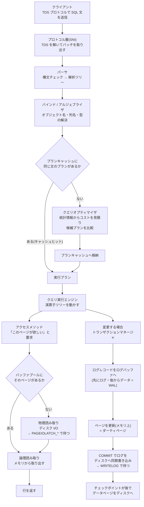
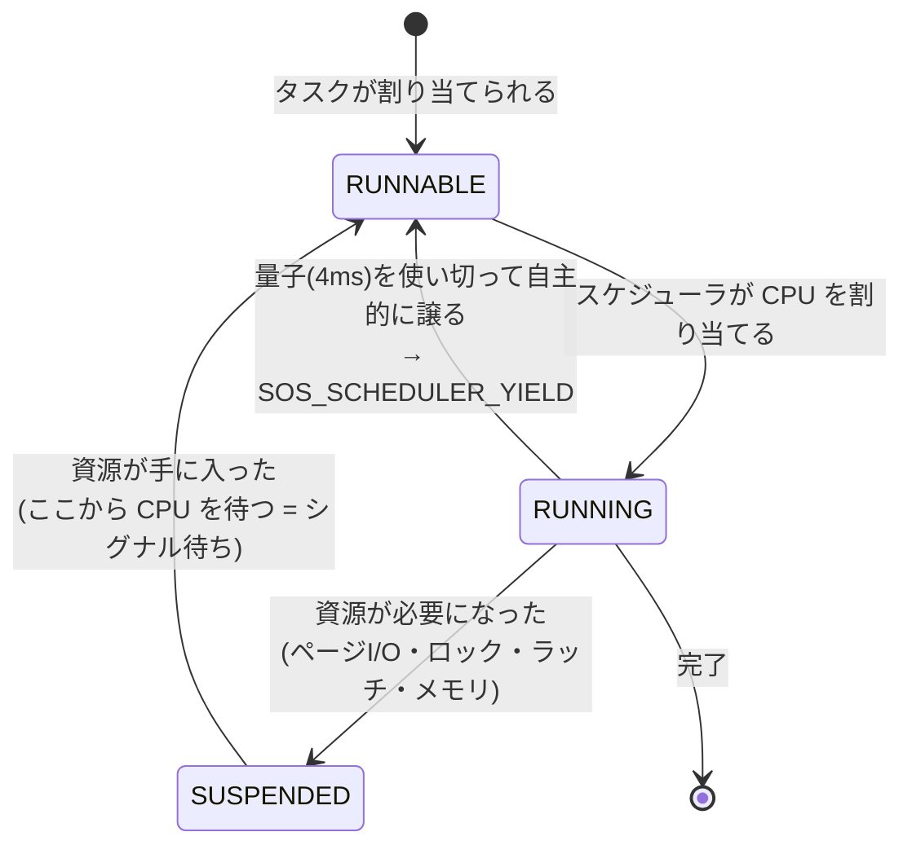

# 33 SQL Server アーキテクチャ

> **このトピックのゴール**: ここまでの章で **観測してきた現象**
> ——論理読み取りが減ると速くなる、`WRITELOG` で待たされる、tempdb で `PAGELATCH_UP` が出る、
> `SOS_SCHEDULER_YIELD` が積み上がる——が **なぜ起きるのか** を、
> SQL Server の内部モデル(リレーショナルエンジン / ストレージエンジン / SQLOS)で
> 説明できるようになる。
> ページとエクステント、バッファプール、ログ先行書き込み、tempdb、スケジューラ、メモリ管理を
> **すべて読み取り専用のクエリで観測しながら**追いかける。
>
> **前提**: [32 インメモリ OLTP](32_in_memory_oltp.md) までを済ませていること。
> 本章は 15・18・19・23・29 章で扱った現象の **説明原理** を与える土台です。

すべての例は先頭で `USE SalesLearning;` を実行済みとします。

> ⚠️ **この章の安全方針**
> 本章に出てくるクエリは、明示的に断っている箇所を除き **すべて読み取り専用** です。
> - サーバー構成(`max server memory` など)は **確認するだけ**。変更例は「現在値の記録 →
>   変更 → 復元」を必ずセットで示し、コメントアウトしてあります。
> - `DBCC` は **読み取り専用のもの(`DBCC PAGE` / `DBCC SQLPERF`)だけ** を扱います。
>   `DBCC DROPCLEANBUFFERS` や `DBCC FREEPROCCACHE` のような
>   **キャッシュを捨てる系は本章では使いません**(理由は第5節)。
> - `sys.dm_db_index_physical_stats` の `DETAILED` モードは対象を全ページ読みます。
>   100万行の `dbo.OrdersBig` では `SAMPLED` を使ってください。

---

## 1. 全体像 — SQL Server を3つの層で捉える

SQL Server のエンジン(`sqlservr.exe`)は、大きく **3つの層**でできています。
この3層に分けて考えるだけで、障害の切り分けの精度が一段上がります。

| 層 | 役割 | ここが原因なら現れる症状 |
|---|---|---|
| **リレーショナルエンジン**(クエリプロセッサ) | SQL 文を解析し、**どう実行するか(実行プラン)を決めて**実行する | 悪いプラン、見積り誤り、パラメータスニッフィング、並列度の暴走 |
| **ストレージエンジン** | 実行プランの指示どおりに **ページを読み書き**し、ロックとログで整合性を守る | I/O 待ち、ロック待ち、ログ書き込み待ち、tempdb 競合 |
| **SQLOS** | CPU スケジューリング・メモリ・同期プリミティブを一手に引き受ける **エンジン内の OS** | CPU 待ち、ワーカースレッド枯渇、メモリ不足 |

- 24〜28章で扱った話題(Query Store・統計情報・カーディナリティ推定・
  パラメータスニッフィング)は **ほぼすべてリレーショナルエンジンの話**です。
- 23章の待機統計で見た `PAGEIOLATCH_*` / `WRITELOG` / `PAGELATCH_*` は
  **ストレージエンジンの話**です。
- 同じく 23章の `SOS_SCHEDULER_YIELD` / `THREADPOOL` は **SQLOS の話**です。

**待機の種類を見て「どの層で詰まっているか」を当てられるようになること**が、この章の実利です。

### 1-1. 1つのクエリが実行されるまで



ここから読み取ってほしいのは、次の3点です。

1. **データは必ずバッファプール(メモリ)を経由する。**
   ディスク上のページを直接読み書きすることはありません(第5節)。
2. **変更は「先にログ、後からデータ」。**
   だから `COMMIT` はログの書き込みを待ちます(第6節)。
3. **どの段階もタダではない。** 各段階に対応する待機やカウンタが必ず存在します。

### 1-2. 段階と観測手段の対応表

| 段階 | 主な観測手段 | 関連章 |
|---|---|---|
| パース/バインド | コンパイルエラー、`sys.dm_exec_query_stats` の `total_compile_time` | — |
| 最適化 | 実行プラン、`sys.dm_exec_query_optimizer_info`、Query Store | 18・24・27・28 |
| プランキャッシュ | `sys.dm_exec_cached_plans` / `sys.dm_exec_query_plan` | 28 |
| 実行(ページ要求) | `SET STATISTICS IO ON` の **論理読み取り数** | 18 |
| バッファプール | `sys.dm_os_buffer_descriptors`、Page life expectancy | 本章 |
| 物理 I/O | `sys.dm_io_virtual_file_stats`、`PAGEIOLATCH_*` | 23 |
| ログ書き込み | `sys.dm_db_log_space_usage`、`WRITELOG` | 23 |
| tempdb | `sys.dm_db_file_space_usage`、`PAGELATCH_*` | 15・23 |
| CPU スケジューリング | `sys.dm_os_schedulers`、`SOS_SCHEDULER_YIELD` | 23・29 |
| メモリ | `sys.dm_os_memory_clerks`、`RESOURCE_SEMAPHORE` | 本章 |

---

## 2. ストレージの階層 — ページ → エクステント → ファイル → ファイルグループ

### 2-1. 4段の入れ子

```
ファイルグループ(PRIMARY など)  ← テーブル/インデックスを「どこに置くか」の単位
  └ データファイル(.mdf / .ndf) ← OS から見たファイル。ここに I/O が発生する
      └ エクステント(8ページ = 64KB) ← 領域を確保する単位
          └ ページ(8KB = 8,192 バイト)  ← 読み書きの最小単位。これがすべての基本
```

**この章でいちばん覚えてほしい数字は 8KB です。**
SQL Server は 1 行だけ欲しいときでも、**その行が載っている 8KB ページを丸ごと**読みます。
「1行取るのに何ページ触ったか」が **論理読み取り数**(18章)であり、
インデックス設計とはつまるところ **触るページ数を減らす作業**です。

- **エクステント**は 8 ページ連続した 64KB の塊です。
  - **均一エクステント(uniform)** … 8 ページすべてが 1 つのオブジェクトのもの。
  - **混合エクステント(mixed)** … 8 ページを最大 8 オブジェクトで分け合う。
  - **SQL Server 2016 以降、ユーザーデータベースの既定は「最初から均一エクステント」** です
    (`MIXED_PAGE_ALLOCATION` が既定 `OFF`。2014 以前は最初の 8 ページが混合エクステントでした)。
    tempdb も 2016 以降は常に均一エクステントを使います。これが第7節の競合対策に効いてきます。
- **ファイルグループ**は配置の論理単位です。テーブルやインデックスは
  「どのファイルグループに作るか」だけを指定でき、**どのファイルに書くかは選べません**。
  SQL Server がファイルグループ内の複数ファイルへ **比例配分(proportional fill)** で振り分けます。
  → tempdb を複数ファイルにする対策(第7節)が効くのは、この比例配分のおかげです。

```sql
-- 自分のデータベースのファイル構成を見る
SELECT df.file_id                             AS ファイルID,
       fg.name                                AS ファイルグループ,
       df.name                                AS 論理ファイル名,
       df.type_desc                           AS 種類,          -- ROWS / LOG
       df.size * 8 / 1024.0                   AS 現在サイズMB,
       CASE df.is_percent_growth
            WHEN 1 THEN CONCAT(df.growth, N'%')
            ELSE CONCAT(df.growth * 8 / 1024, N'MB')
       END                                    AS 自動拡張,
       df.physical_name                       AS 物理パス
FROM   sys.database_files AS df
LEFT   JOIN sys.filegroups AS fg ON fg.data_space_id = df.data_space_id
ORDER  BY df.type, df.file_id;
```

### 2-2. 8KB ページの中身

```
 ┌────────────────────────────────────────────────────────┐  ← 8,192 バイト
 │ ページヘッダー(96 バイト・固定長)                      │
 │   ページ番号 / オブジェクトID / インデックスID /        │
 │   格納行数(m_slotCnt) / 空き容量(m_freeCnt) /        │
 │   前後ページへのポインタ / LSN …                        │
 ├────────────────────────────────────────────────────────┤
 │ 行データ(ページ先頭側から詰めて格納)→→→               │
 │  [ 行1 ][ 行2 ][ 行3 ] …                                │
 │                                                        │
 │                 (空き領域)                            │
 │                                                        │
 │              ←←← [オフセット3][オフセット2][オフセット1] │
 ├────────────────────────────────────────────────────────┤
 │ 行オフセット配列(末尾から逆向き・1行あたり 2 バイト)    │
 └────────────────────────────────────────────────────────┘
```

- **ヘッダー 96 バイト**を引いた **8,096 バイト**が、行データと行オフセット配列に使えます。
- **1 行の最大サイズは 8,060 バイト**(公式に明記された上限)。差の 36 バイトは内部予約です。
- **行オフセット配列**は「N 番目の行がページ先頭から何バイト目にあるか」を持つ 2 バイトの配列で、
  **ページの末尾から逆向きに**伸びます。
  行データは前から、オフセット配列は後ろから伸びて、**真ん中の空きがなくなるとページが満杯**です。
- 重要な帰結: **ページ上で行は物理的に順番に並んでいる必要がありません**。
  「並び順」はオフセット配列が表現しています。だから行の挿入は、
  ページに空きさえあれば **既存行を動かさずに**できます。

> ⚠️ **クラスター化インデックスが「物理的な並び順」だというのは、正確には言い過ぎ**です。
> 正しくは「**ページ間はリンクリストで論理的に並んでいて、ページ内の順序は
> 行オフセット配列が表現している**」です。だからページ分割や断片化(第4節)が起きても、
> 論理的な順序は保たれます。

### 2-3. 特殊なページ — PFS / GAM / SGAM / IAM

各データファイルには、**データではなく「空き状況の地図」を持つページ**が定期的に挟まっています。
第7節の tempdb 競合を理解するのに必須の知識です。

| ページ | 役割 | 出現位置 | カバー範囲 |
|---|---|---|---|
| **PFS**(Page Free Space) | **1 ページごと**の空き具合と割り当て済みかを 1 バイトで記録 | ページ **1**、以後 **8,088 ページごと** | 約 64MB |
| **GAM**(Global Allocation Map) | **エクステント**が割り当て済みかを 1 ビットで記録 | ページ **2**、以後 **511,232 ページごと** | 約 4GB |
| **SGAM**(Shared GAM) | **混合エクステント**で空きページが残っているかを記録 | ページ **3**、以後 **511,232 ページごと** | 約 4GB |
| **IAM**(Index Allocation Map) | **1 つのオブジェクト**がどのエクステントを使っているかを記録 | オブジェクトごとに随時 | 約 4GB |
| **ブートページ** | データベースの基本情報 | ファイル 1 のページ **9** | — |

- ファイルの先頭付近(ページ 0〜3)に集中していること、
  そして **PFS が 8,088 ページ(約 64MB)おきにしか無い**ことを覚えてください。
- ページを新しく割り当てるたびに **PFS を更新しなければならない**ため、
  大量の同時割り当てが起きると **PFS ページが取り合いになります**。これが第7節の主題です。

### 2-4. 1ページに入る行数が I/O 量を決める(18章との接続)

**これが本節の結論**です。実際に測ってみましょう。

```sql
-- dbo.OrdersBig(100万行)の物理的な姿を見る
-- ※ SAMPLED モード。DETAILED は全ページを読むので大きい表では避ける
SELECT i.name                                    AS インデックス名,
       ips.index_type_desc                       AS 種別,
       ips.page_count                            AS ページ数,
       ips.record_count                          AS 行数,
       ips.avg_record_size_in_bytes              AS 平均行サイズ,
       ips.avg_page_space_used_in_percent        AS ページ使用率,
       ips.record_count * 1.0 / NULLIF(ips.page_count, 0) AS 一ページあたり行数,
       ips.page_count * 8 / 1024.0               AS 合計MB
FROM   sys.dm_db_index_physical_stats(
           DB_ID(), OBJECT_ID(N'dbo.OrdersBig'), NULL, NULL, N'SAMPLED') AS ips
JOIN   sys.indexes AS i
       ON i.object_id = ips.object_id AND i.index_id = ips.index_id
WHERE  ips.index_level = 0;      -- リーフレベル(実データ)だけ
```

```sql
-- もっと軽い方法(統計メタデータを読むだけ。表の走査なし)
SELECT OBJECT_NAME(ps.object_id)         AS テーブル,
       ps.index_id                       AS インデックスID,
       ps.row_count                      AS 行数,
       ps.in_row_data_page_count         AS 行内データページ数,
       ps.used_page_count                AS 使用ページ数,
       ps.used_page_count * 8 / 1024.0   AS 使用MB
FROM   sys.dm_db_partition_stats AS ps
WHERE  ps.object_id = OBJECT_ID(N'dbo.OrdersBig');
```

`dbo.OrdersBig` の 1 行はおおよそ **45〜50 バイト**、つまり
**1 ページに 160〜170 行**ほど入ります(環境により前後します)。すると:

```
1,000,000 行 ÷ 約 166 行/ページ ≒ 約 6,000 ページ
```

**18章で `dbo.OrdersBig` を全件スキャンしたときの論理読み取り数 `6018` は、
まさにこの「表全体のページ数」だった**わけです。
`SET STATISTICS IO ON` が返していた数字の正体がここで分かります。

ここから、設計に直結する原則が出ます。

- **行を細くすると、同じ行数がより少ないページに収まり、論理読み取りが減る。**
  - `NVARCHAR` で足りるところを無闇に `NVARCHAR(MAX)` にしない。
  - `BIGINT` が要らないところを `BIGINT` にしない(4 バイトの差が 100万行で 4MB)。
  - 使わない列を持ち回らない(`SELECT *` を避ける理由の物理的な根拠がこれです)。
- **カバリングインデックスが劇的に効くのは、「必要な列だけの細い行」を作るから。**
  18章で論理読み取りが 900 → 5 になったのは、
  **1 ページあたりの行数が桁違いに増えた索引を新しく作った**からです。
- **圧縮(ROW / PAGE 圧縮)が CPU を使ってでも速くなることがあるのも同じ理屈**です。
  1 ページに入る行数が増えれば、読むページ数が減ります。

> ⚠️ 逆に「1 行が 4,000 バイト超」の設計は要注意です。
> 1 ページに **2 行しか入らない**ため、8KB を読んで 2 行しか得られません。
> 大きな `NVARCHAR` 列を持つ表は、**検索に使う列だけを別表に分ける**か、
> LOB として行外に追い出す(第3節)ことを検討します。

---

## 3. 行の物理設計 — 8,060 バイトの壁、行オーバーフロー、LOB

### 3-1. 3種類の割り当てユニット

1 つのインデックス(パーティション)は、内部的に **最大3種類の領域**を持ちます。

| 割り当てユニット | 何が入るか |
|---|---|
| **IN_ROW_DATA** | 通常の行データ。固定長列と、行内に収まった可変長列 |
| **ROW_OVERFLOW_DATA** | 行が 8,060 バイトを超えたときに **押し出された可変長列**(`varchar` / `nvarchar` / `varbinary` / `sql_variant`) |
| **LOB_DATA** | `varchar(max)` / `nvarchar(max)` / `varbinary(max)` / `xml` / `text` / `image` などの大きな値 |

```sql
-- 割り当てユニットの内訳を見る
SELECT OBJECT_NAME(p.object_id)   AS テーブル,
       i.name                     AS インデックス,
       au.type_desc               AS 割り当てユニット,   -- IN_ROW_DATA / ROW_OVERFLOW_DATA / LOB_DATA
       au.total_pages             AS 予約ページ数,
       au.used_pages              AS 使用ページ数,
       au.data_pages              AS データページ数
FROM   sys.allocation_units AS au
JOIN   sys.partitions       AS p  ON p.partition_id = au.container_id
JOIN   sys.indexes          AS i  ON i.object_id = p.object_id AND i.index_id = p.index_id
WHERE  p.object_id IN (OBJECT_ID(N'dbo.Orders'), OBJECT_ID(N'dbo.OrderDetails'),
                       OBJECT_ID(N'dbo.OrdersBig'))
ORDER  BY テーブル, i.index_id, au.type_desc;
```

### 3-2. 行オーバーフローと LOB のふるまい

- **固定長列の合計が 8,060 バイトを超える表は、そもそも作れません**(作成時にエラー、
  または警告のうえ挿入時に失敗)。
- **可変長列がある場合**、実際のデータで 8,060 バイトを超えると、SQL Server は
  いちばん大きい可変長列を **ROW_OVERFLOW_DATA へ押し出し**、
  元の行には **24 バイトのポインタ**だけを残します。
- `varchar(max)` などの LOB は、既定では **8,000 バイトを超えたら LOB_DATA へ**格納され、
  行内にはポインタだけが残ります。

**性能上の意味**: 行外に出た列を `SELECT` すると、
**1 行ごとに追加のページアクセスが発生します**。18章の Key Lookup と同じ構図です。

```sql
-- 行外アクセスがどれくらい起きているかは、この2つの差で見える
SET STATISTICS IO ON;
-- ① 行内の列だけを取る
SELECT OrderId, OrderDate FROM dbo.OrdersBig WHERE OrderId BETWEEN 1 AND 1000;
-- ② 大きな列も取る(LOB 列を持つ表なら "LOB 論理読み取り数" が別枠で表示される)
SET STATISTICS IO OFF;
```

> ⚠️ `SET STATISTICS IO ON` の出力には **`LOB 論理読み取り数`(lob logical reads)** という
> **別枠のカウンタ**があります。通常の論理読み取りが少ないのに遅いときは、
> ここが跳ね上がっていないか必ず確認してください。

### 3-3. 設計指針(この節の実利)

1. **データ型は「入る中でいちばん小さいもの」を選ぶ。** 行が細くなる = ページ数が減る = I/O が減る。
2. **`NVARCHAR(MAX)` を安易に使わない。** 8,000 バイト以下なら `NVARCHAR(4000)` で足ります。
3. **検索・結合・集計に使う列と、大きなテキスト列は別テーブルに分ける**ことを検討する。
4. **NULL 許容の可変長列は、末尾に置いても物理配置は SQL Server が決める。**
   列順を並べ替えても性能は基本的に変わりません(手を入れるなら型のほうです)。

---

## 4. ヒープ、クラスター化インデックス、ページ分割、フィルファクター

### 4-1. ヒープ vs クラスター化インデックス

| | **ヒープ**(クラスター化インデックスなし) | **クラスター化インデックス** |
|---|---|---|
| データの持ち方 | ページに順不同で置かれる。IAM で管理 | **B木**。リーフレベルが **データ行そのもの** |
| 行の識別子 | **RID**(ファイルID:ページID:スロット番号) | **クラスター化キー** |
| 非クラスター化索引が持つポインタ | RID | **クラスター化キーの値** |
| 範囲検索 | 不得意(全走査になりがち) | 得意(リーフを順に辿るだけ) |
| 特有の問題 | **転送レコード(forwarded record)** | **ページ分割(page split)** |

**転送レコード**: ヒープの行を更新して元のページに収まらなくなると、
SQL Server は行を別ページへ移し、**元の場所に「転送先」の目印だけ残します**。
非クラスター化索引が持つ RID を変えずに済ませるための仕組みですが、
読むたびに **2 ページ触る**ことになります。

```sql
-- 転送レコード数はここで見える(ヒープのときだけ意味を持つ)
SELECT OBJECT_NAME(ips.object_id) AS テーブル,
       ips.index_type_desc        AS 種別,
       ips.forwarded_record_count AS 転送レコード数,
       ips.page_count             AS ページ数
FROM   sys.dm_db_index_physical_stats(
           DB_ID(), OBJECT_ID(N'dbo.OrdersBig'), NULL, NULL, N'SAMPLED') AS ips;
```

> ⚠️ **実務の原則: ほぼすべての表にクラスター化インデックスを付ける。**
> ヒープは「一時的な取り込み用」「追記だけして全件読む」など限られた用途向けです。
> `dbo.OrdersBig` も `dbo.SalesFact` も、クラスター化主キーを持っています。

### 4-2. ページ分割(page split)

**ページに空きが無い状態で、そのページの途中に行を挿入しようとすると起きる現象**です。

```
【分割前】ページA が満杯。ここに新しい行を入れたい
   ページA: [ 100 ][ 101 ][ 102 ][ 103 ][ 104 ]  ← 空きなし。105 ではなく 102.5 を入れたい

【分割後】新しいページを確保し、行のおよそ半分を移動する
   ページA: [ 100 ][ 101 ][ 102 ]  … 空き
   ページC: [ 102.5 ][ 103 ][ 104 ] … 空き     ← 新規確保
   ページA → ページC → ページB とリンクを張り替える
```

ページ分割の代償は3つあります。

1. **その場のコスト** … 新ページの確保、行の移動、リンクの張り替え。
   これらは **すべてトランザクションログに記録される**(第6節)ため、ログ量が跳ね上がります。
2. **断片化** … 論理的な順序と物理的な配置がずれます。
   範囲検索(`ORDER BY` を伴うスキャン)がランダム I/O に近づきます。
3. **密度の低下** … 分割直後の 2 ページは **半分しか埋まっていません**。
   同じデータを読むのに **ページ数が増える** = 論理読み取りが増える(第2節の逆向き)。

```sql
-- 断片化と密度を測る
SELECT i.name                                AS インデックス,
       ips.index_type_desc                   AS 種別,
       ips.avg_fragmentation_in_percent      AS 断片化率,
       ips.avg_page_space_used_in_percent    AS ページ使用率,
       ips.page_count                        AS ページ数,
       ips.fill_factor                       AS 設定フィルファクター
FROM   sys.dm_db_index_physical_stats(
           DB_ID(), OBJECT_ID(N'dbo.OrdersBig'), NULL, NULL, N'SAMPLED') AS ips
JOIN   sys.indexes AS i
       ON i.object_id = ips.object_id AND i.index_id = ips.index_id
WHERE  ips.index_level = 0;
```

判断の目安(環境によるので絶対視しないこと):

| 断片化率 | 一般的な対応 |
|---|---|
| 〜5% | 何もしない |
| 5〜30% | `ALTER INDEX ... REORGANIZE`(オンライン・軽い) |
| 30%〜 | `ALTER INDEX ... REBUILD`(重い。ログも大量に出る) |

> ⚠️ **ページ数が少ない索引(目安 1,000 ページ未満)の断片化率は無視してよい**です。
> 数ページしかない索引はどのみち全部メモリに載るので、並び順は性能にほぼ影響しません。
> 「断片化率が高いから」という理由だけで夜間に全索引を `REBUILD` するジョブは、
> **ログを大量に生み、バッファプールを汚す**割に効果が薄いことがあります。

### 4-3. フィルファクター

**`FILLFACTOR` は「インデックスを作る/再構築するとき、リーフページをどこまで埋めるか」の指定**です。

```sql
-- 現在の設定を確認する(0 は 100 と同じ意味 = 満杯まで詰める)
SELECT OBJECT_NAME(i.object_id) AS テーブル, i.name AS インデックス,
       i.fill_factor            AS フィルファクター,
       i.is_padded              AS 中間ページにも適用するか
FROM   sys.indexes AS i
WHERE  i.object_id IN (OBJECT_ID(N'dbo.OrdersBig'), OBJECT_ID(N'dbo.Orders'))
  AND  i.index_id > 0;
```

- **`FILLFACTOR = 100`(既定)** … 満杯まで詰める。読み取りには最良(ページ数が最小)。
  ただし **途中への挿入が多いと即ページ分割**。
- **`FILLFACTOR = 80` など** … 各ページに 20% の余白を残す。
  ページ分割を先送りできるが、**ページ数が 25% 増える** = 読み取りの論理読み取りも増える。

**使い分けの判断基準**:

| キーの性質 | 例 | 推奨 |
|---|---|---|
| **単調増加**(常に末尾に追加) | `IDENTITY` の `OrderId`、日付順の `SaleId` | **`FILLFACTOR = 100` のまま**。途中への挿入が無いのでページ分割が起きない |
| **ランダム** | `NEWID()` の GUID、ハッシュ値 | 低めの `FILLFACTOR`(80〜90)を検討。ただし **そもそもクラスター化キーにしない**のが本筋 |
| **更新で行が太る** | 可変長列を後から埋める | 低めの `FILLFACTOR` |

> ⚠️ 単調増加キーには **「末尾ページの競合(last-page insert contention)」** という
> 別の問題があります。全セッションが同じ最終ページに挿入するため、
> **`PAGELATCH_EX` 待ち**が集中します(23章)。
> 対策は SQL Server 2019 以降の **`OPTIMIZE_FOR_SEQUENTIAL_KEY = ON`** です。
> 「ページ分割を避けたい」と「末尾に集中させたくない」はトレードオフだと理解してください。

---

## 5. バッファプール — データは必ずメモリを経由する

### 5-1. 大原則

> **SQL Server はディスク上のページを直接読み書きしない。**
> **読むときは必ずバッファプールへ載せてから読み、書くときはバッファプール上のページを
> 書き換えてから、後でまとめてディスクへ書く。**

この 1 行から、以下がすべて導けます。

| 用語 | 意味 |
|---|---|
| **論理読み取り**(logical reads) | **バッファプールからページを取り出した回数**。ヒットしたかどうかに関係なく数える |
| **物理読み取り**(physical reads) | バッファプールに無くて **ディスクから読み込んだ**回数 |
| **先読み読み取り**(read-ahead reads) | スキャンすると分かっているページを **先回りして**非同期に読み込んだ数 |
| **ダーティページ**(dirty page) | メモリ上で更新されたが、まだディスクへ書かれていないページ |
| **`PAGEIOLATCH_SH` / `_EX`** | 物理読み取りの完了を待っている状態(= I/O 待ち)。23章 |
| **`PAGELATCH_SH` / `_EX` / `_UP`** | **メモリ上の**ページへのアクセスを待っている状態(I/O は関係ない)。23章・第7節 |

> ⚠️ **`PAGEIOLATCH_*` と `PAGELATCH_*` は「IO」の 2 文字しか違わないのに、意味が正反対**です。
> - `PAGEIOLATCH_*` … **ディスクが遅い**。ストレージ・メモリ不足を疑う。
> - `PAGELATCH_*` … **メモリ上のページの取り合い**。tempdb 割り当て競合や末尾ページ競合を疑う。
> 23章の待機統計で最初に見分けるべき区別がこれです。

**そして、これが 18章の合言葉「論理読み取り数で比較せよ」の根拠**です。
経過時間や物理読み取り数は、そのページがたまたまメモリに載っていたかで大きくブレます。
**論理読み取り数はキャッシュ状態に左右されない**ので、
インデックスやクエリの良し悪しを比べる指標として安定しているのです。

> ⚠️ だからこそ、本章では `DBCC DROPCLEANBUFFERS`(バッファプールを空にする)を使いません。
> **キャッシュを捨てて比較する必要はない**うえに、共有環境ではほかのすべてのクエリを
> 巻き添えで遅くします。**論理読み取りで比べれば済む**、と覚えてください。

### 5-2. バッファプールの中身を見る

```sql
-- ① どのデータベースがバッファプールを何MB使っているか
SELECT CASE database_id
            WHEN 32767 THEN N'(リソースDB)'
            ELSE DB_NAME(database_id)
       END                       AS データベース,
       COUNT(*)                  AS ページ数,
       COUNT(*) * 8 / 1024.0     AS 使用MB
FROM   sys.dm_os_buffer_descriptors
GROUP  BY database_id
ORDER  BY 使用MB DESC;
```

```sql
-- ② SalesLearning の中で、どのテーブル/インデックスが占めているか
SELECT TOP (20)
       OBJECT_NAME(p.object_id)          AS オブジェクト,
       i.name                            AS インデックス,
       i.type_desc                       AS 種別,
       COUNT(*)                          AS ページ数,
       COUNT(*) * 8 / 1024.0             AS 使用MB,
       SUM(CAST(bd.is_modified AS INT))  AS ダーティページ数
FROM   sys.dm_os_buffer_descriptors AS bd
JOIN   sys.allocation_units AS au ON au.allocation_unit_id = bd.allocation_unit_id
JOIN   sys.partitions       AS p
       ON (au.type IN (1, 3) AND p.hobt_id     = au.container_id)
       OR (au.type = 2       AND p.partition_id = au.container_id)
JOIN   sys.indexes          AS i
       ON i.object_id = p.object_id AND i.index_id = p.index_id
WHERE  bd.database_id = DB_ID(N'SalesLearning')
GROUP  BY p.object_id, i.name, i.type_desc
ORDER  BY ページ数 DESC;
```

**この②のクエリは実務で非常によく使います。**
「メモリが足りない」という相談を受けたら、まずこれを流して
**「何がメモリを食っているのか」を事実として掴む**のが第一歩です。
巨大な履歴テーブルの全件スキャンが毎晩走っていてバッファプールを押し流している、
といった原因がここで一目で分かります。

### 5-3. Page Life Expectancy(PLE)の正しい読み方

**PLE = 「今バッファプールに入ったページが、追い出されるまでに留まれると期待される秒数」** です。

```sql
SELECT RTRIM(object_name)  AS カウンタ分類,
       instance_name       AS ノード,
       cntr_value          AS PLE秒
FROM   sys.dm_os_performance_counters
WHERE  counter_name = N'Page life expectancy'
ORDER  BY object_name, instance_name;
```

- 値が **小さい = ページがすぐ追い出されている = メモリが足りていない可能性** です。
- **「300 秒を下回ったら危険」という古い経験則は、もう使ってはいけません。**
  この数字は「4GB メモリ」時代の目安であり、
  数百 GB のメモリを積んだ現在のサーバーには全く当てはまりません。

**PLE を単独で判断してはいけない理由**:

1. **絶対値に意味がない。** 見るべきは **推移(トレンド)** です。
   「平常時 20,000 だったものが、夜間バッチの時間帯だけ 500 に落ちる」という**変化**が情報です。
2. **一時的な落ち込みは正常。** 大きなテーブルを 1 回スキャンすれば PLE は必ず落ちます。
   それは「メモリ不足」ではなく「大きなスキャンをした」というだけです。
   → **PLE が落ちたら、まず第 5-2 節②で「何が入ってきたか」を見る**のが正しい順序です。
3. **NUMA 環境では合計値が嘘をつく。** `Buffer Node` ごとの PLE を見ないと、
   片方のノードだけが枯渇していることを見逃します(上のクエリで `object_name` を分けている理由)。
4. **PLE が高くても遅いことはある。** メモリは足りていても、
   そもそもクエリが必要以上のページを触っていれば遅いままです(=インデックスの問題)。

> ⚠️ **判断の順序**:
> 「遅い」→ 待機統計(23章)で `PAGEIOLATCH_*` が上位か → 上位なら
> `sys.dm_io_virtual_file_stats` で本当にストレージが遅いのか確認 →
> 同時に PLE の推移とバッファプールの内訳を見る →
> **最後に「そのクエリはそんなに読む必要があるのか」を疑う(18章)**。
> **メモリを足す前に、読むページ数を減らせないかを必ず検討してください。**

### 5-4. チェックポイント と Lazy Writer の違い

**この2つを混同している人は非常に多い**ので、表で整理します。

| | **チェックポイント** | **Lazy Writer** |
|---|---|---|
| 目的 | **復旧時間を短くする** | **空きメモリを確保する** |
| きっかけ | 一定量のログが溜まった / 目標復旧時間 / `BACKUP` / DB のシャットダウン / 手動 `CHECKPOINT` | **メモリ不足**(空きページリストが減った) |
| 何を書くか | **ダーティページ**をディスクへ書く | **最も使われていないページ**(LRU-K)を追い出す。ダーティなら書いてから追い出す |
| **書いたページはメモリから消えるか** | **消えない**(きれいになるだけ) | **消える**(追い出しが目的) |
| 対象 | データベース単位 | インスタンス全体 |
| 多いと何を意味するか | 更新が多い(正常なことが多い) | **メモリ圧迫のサイン** |

- **チェックポイントが無いと何が困るか**: 障害から起動するとき、SQL Server は
  「最後のチェックポイント以降のログ」を読み直して復旧します。
  チェックポイントの間隔が長いほど **起動が遅くなります**。
- SQL Server 2016 以降で新規作成したデータベースは、既定で
  **間接チェックポイント(indirect checkpoint)** が有効で、
  `TARGET_RECOVERY_TIME = 60 秒` に設定されています。

```sql
-- 目標復旧時間の設定を確認する(読み取りのみ)
SELECT name                     AS データベース,
       target_recovery_time_in_seconds AS 目標復旧時間秒,
       recovery_model_desc      AS 復旧モデル
FROM   sys.databases
WHERE  name IN (N'SalesLearning', N'tempdb', N'master');
```

### 5-5. 本当にストレージが遅いのかを測る

```sql
-- ファイル単位の I/O 統計(インスタンス起動時からの累計)
SELECT DB_NAME(vfs.database_id)                 AS データベース,
       mf.name                                  AS 論理ファイル名,
       mf.type_desc                             AS 種類,
       vfs.num_of_reads                         AS 読み取り回数,
       vfs.num_of_bytes_read / 1024 / 1024      AS 読み取りMB,
       CASE WHEN vfs.num_of_reads = 0 THEN 0
            ELSE vfs.io_stall_read_ms / vfs.num_of_reads END   AS 平均読み取り待ちms,
       vfs.num_of_writes                        AS 書き込み回数,
       vfs.num_of_bytes_written / 1024 / 1024   AS 書き込みMB,
       CASE WHEN vfs.num_of_writes = 0 THEN 0
            ELSE vfs.io_stall_write_ms / vfs.num_of_writes END AS 平均書き込み待ちms
FROM   sys.dm_io_virtual_file_stats(NULL, NULL) AS vfs
JOIN   sys.master_files AS mf
       ON mf.database_id = vfs.database_id AND mf.file_id = vfs.file_id
ORDER  BY 平均読み取り待ちms DESC;
```

判断の目安(あくまで一般論。ストレージ製品により大きく変わります):

| 対象 | 望ましい平均待ち時間 | 注意すべき値 |
|---|---|---|
| データファイル(ランダム読み取り) | 10ms 未満 | 20ms 超が続くなら要調査 |
| **ログファイル(書き込み)** | **5ms 未満** | **10ms 超なら `WRITELOG` の温床**(第6節) |

> ⚠️ この DMV は **インスタンス起動からの累計**です。
> 「今遅いのか」を知りたければ、**2 時点で取得して差分を取る**必要があります。
> 累計値だけを見て「平均 3ms だから健全」と判断すると、
> 夜間だけ 200ms になっている事実を見逃します。

---

## 6. ログ先行書き込み(WAL)— 耐久性の代償

### 6-1. 原則

> **WAL(Write-Ahead Logging): データページをディスクに書く前に、
> その変更を記録したログレコードを必ず先にディスクへ書く。**

なぜこの順序でなければならないのか。逆の順序を想像すれば分かります。
データページを先に書いた直後に電源が落ちたら、
**「変更されたデータはあるのに、それを取り消す情報が無い」** 状態になり、
ロールバックできなくなります。

`UPDATE` 1 件が実行されるときの流れ:

```
① ログレコードを「ログバッファ」(メモリ・データベースごとに約 60KB)に書く
② バッファプール上のデータページを書き換える → ダーティページになる
   ※ この時点でディスクは一切変わっていない
③ COMMIT
     → ログバッファの内容をログファイルへ「同期書き込み」する
     → 書き込み完了を待つ間、そのセッションは WRITELOG で待機する ★
     → 完了して初めてクライアントに「コミット成功」を返す
④ あとでチェックポイントがダーティページをデータファイルへ書く(非同期)
```

### 6-2. だから `WRITELOG` が発生する(23章との接続)

**★ の 1 行が `WRITELOG` 待機の正体**です。

- 耐久性(ACID の D)を保証するには、**`COMMIT` の時点でログが物理的に書かれている必要がある**。
- だから `COMMIT` は **必ずディスク I/O の完了を待ちます**。避けようがありません。
- つまり **`WRITELOG` が上位に来るのは「更新が多い」という正常な状態**でもあります。
  問題は **1 回あたりの待ち時間**です。

**`WRITELOG` が問題かどうかの判断基準**:

| 確認すること | 見るもの | 対策の方向 |
|---|---|---|
| ログの書き込みが物理的に遅い | `sys.dm_io_virtual_file_stats` のログファイルの平均書き込み待ち(5ms 超か) | ログファイルを速いストレージへ。**データファイルと別のドライブへ** |
| コミット回数が多すぎる | アプリのループ構造。1 行ごとに `COMMIT` していないか | **バッチにまとめる**(1000 行を 1 トランザクションで) |
| ログファイルが自動拡張を繰り返している | ログのサイズ推移、`sys.dm_db_log_info` の VLF 数 | 初期サイズを適切に確保する |
| 1 トランザクションのログ量が多すぎる | ページ分割、索引の `REBUILD`、大量 `UPDATE` | 第4節・分割実行 |

> ⚠️ **「1 行ずつ `COMMIT` するループ」は `WRITELOG` の最大の生産者**です。
> 1000 行を 1 行ずつコミットすれば **ログのフラッシュが 1000 回**、
> 1 トランザクションにまとめれば **原則 1 回**です。
> ログの平均書き込み待ちが 5ms なら、これだけで 5 秒の差になります。
> 本章の演習 Q8 で実際に測ります。

> ⚠️ SQL Server 2014 以降には **遅延持続性(`DELAYED_DURABILITY`)** という
> データベースオプションがあり、`COMMIT` でログのフラッシュを待たなくなります。
> `WRITELOG` は劇的に減りますが、**障害時に直近のコミット済みトランザクションが失われます**。
> 「失われても再投入できるログ的なデータ」以外には使わないでください。
> ```sql
> -- 現在値の確認(読み取りのみ)
> SELECT name, delayed_durability_desc FROM sys.databases WHERE name = N'SalesLearning';
> -- 変更する場合は必ず元の値を控えてから。学習環境限定。
> --   ALTER DATABASE SalesLearning SET DELAYED_DURABILITY = FORCED;
> -- 復元(既定は DISABLED)
> --   ALTER DATABASE SalesLearning SET DELAYED_DURABILITY = DISABLED;
> ```

### 6-3. VLF(仮想ログファイル)

トランザクションログファイル(`.ldf`)は、内部的に **VLF という区画の並び**として管理されます。
ログは VLF を **順に使い、末尾まで行ったら先頭へ戻る「循環バッファ」** として動きます。

```sql
-- VLF の状況を見る(SQL Server 2017+ / 2016 SP2+)
SELECT COUNT(*)                                   AS VLF総数,
       SUM(CASE WHEN vlf_active = 1 THEN 1 ELSE 0 END) AS アクティブVLF数,
       MIN(vlf_size_mb)                           AS 最小VLFサイズMB,
       MAX(vlf_size_mb)                           AS 最大VLFサイズMB
FROM   sys.dm_db_log_info(DB_ID(N'SalesLearning'));

-- ログ全体の使用率(SQL Server 2012+)
SELECT DB_NAME()                                  AS データベース,
       total_log_size_in_bytes / 1024 / 1024      AS ログ合計MB,
       used_log_space_in_bytes  / 1024 / 1024     AS 使用MB,
       used_log_space_in_percent                  AS 使用率
FROM   sys.dm_db_log_space_usage;

-- 全データベースをまとめて見る昔ながらの方法(読み取り専用の DBCC)
DBCC SQLPERF(LOGSPACE);
```

**VLF の数が問題になる理由**:

- **多すぎる(数千個)** → データベースの復旧・起動が遅くなる、ログバックアップが遅くなる、
  レプリケーションや可用性グループのログ読み取りが遅くなる。
  原因は **小さな自動拡張の繰り返し**(1MB ずつ何千回も拡張した、など)。
- **少なすぎる(巨大な VLF)** → ログの切り捨て(再利用)の粒度が粗くなり、
  ログが縮まりにくくなる。

VLF がいくつ作られるかは拡張サイズで決まります(SQL Server 2014 以降):

| 1回の拡張サイズ | 作られる VLF 数 |
|---|---|
| 現在のログサイズの **1/8 未満** | **1 個** |
| 1/8 以上で 64MB 以下 | 4 個 |
| 64MB 超 〜 1GB | 8 個 |
| 1GB 超 | 16 個 |

> ⚠️ **実務の定石**: ログファイルは **必要なサイズを最初に確保**し、
> 自動拡張は「万一の保険」として **固定サイズ(例: 512MB や 1GB)** で設定します。
> **パーセント指定の自動拡張は避けてください**(大きくなるほど 1 回の拡張が重くなる)。
> なお **SQL Server 2022 では、新規データベースのログの既定自動拡張が 64MB** に変わりました
> (それ以前は 10%)。

### 6-4. ログの切り捨てと復旧モデル

**「ログの切り捨て(truncation)」= ファイルが小さくなることではありません。**
**「もう不要になった VLF を、再利用可能な状態にすること」** です。
ファイルサイズは変わりません(縮めるには `DBCC SHRINKFILE` が必要ですが、
これは断片化を招くので日常的に行うものではありません)。

| 復旧モデル | ログの切り捨てタイミング | ポイントインタイム復旧 | 一括操作のログ量 |
|---|---|---|---|
| **SIMPLE** | **チェックポイントで自動** | できない(最後のバックアップ時点まで) | 最小ログ記録 |
| **FULL** | **ログバックアップを取ったときだけ** | **できる** | 完全ログ記録 |
| **BULK_LOGGED** | ログバックアップを取ったときだけ | 一括操作を含む期間はできない | 最小ログ記録 |

```sql
-- 復旧モデルと「ログが切り捨てられない理由」を確認する
SELECT name                    AS データベース,
       recovery_model_desc     AS 復旧モデル,
       log_reuse_wait_desc     AS ログ再利用を妨げているもの,
       state_desc              AS 状態
FROM   sys.databases
ORDER  BY name;
```

**`log_reuse_wait_desc` はログ肥大化調査の一撃必殺の列**です。主な値:

| 値 | 意味 | 対処 |
|---|---|---|
| `NOTHING` | 妨げるものは無い | 正常 |
| `CHECKPOINT` | 次のチェックポイント待ち | ほぼ正常。すぐ解消する |
| **`LOG_BACKUP`** | **ログバックアップが必要** | **最頻出**。FULL 復旧モデルなのにログバックアップを取っていない |
| **`ACTIVE_TRANSACTION`** | **開きっぱなしのトランザクションがある** | 犯人を特定して終わらせる(19章) |
| `ACTIVE_BACKUP_OR_RESTORE` | バックアップ/復元の実行中 | 終わるまで待つ |
| `REPLICATION` / `AVAILABILITY_REPLICA` | レプリケーション/可用性グループが未消化 | 該当機能側を調査 |
| `DATABASE_SNAPSHOT_CREATION` | スナップショット作成中 | 待つ |

### 6-5. ログが肥大化する典型原因(実務で必ず出会う)

1. **FULL 復旧モデルなのにログバックアップを取っていない。**
   **圧倒的第 1 位**です。「フルバックアップを毎晩取っているから大丈夫」は誤りで、
   FULL 復旧モデルでは **ログバックアップを取るまでログは一切切り捨てられません**。
   → 対処: ログバックアップを定期実行するか、
   ポイントインタイム復旧が不要なら **SIMPLE に変更する**。
2. **長時間開いたままのトランザクション。**
   `BEGIN TRAN` した位置より後ろのログは、すべて「アクティブ」として保持されます。
   1 行の `UPDATE` でも、開きっぱなしなら数十 GB のログを固定できます(19章の警告の物理的な理由)。
   ```sql
   -- 最も古い開いているトランザクションを特定する
   SELECT st.session_id             AS セッションID,
          at.transaction_begin_time AS 開始時刻,
          DATEDIFF(MINUTE, at.transaction_begin_time, SYSDATETIME()) AS 経過分,
          s.login_name, s.host_name, s.program_name,
          t.text                    AS 実行中SQL
   FROM   sys.dm_tran_active_transactions  AS at
   JOIN   sys.dm_tran_session_transactions AS st ON st.transaction_id = at.transaction_id
   JOIN   sys.dm_exec_sessions             AS s  ON s.session_id = st.session_id
   OUTER  APPLY (SELECT TOP (1) r.sql_handle
                 FROM sys.dm_exec_requests AS r
                 WHERE r.session_id = st.session_id) AS req
   OUTER  APPLY sys.dm_exec_sql_text(req.sql_handle) AS t
   ORDER  BY at.transaction_begin_time;
   ```
3. **巨大な単一トランザクション。**
   「1000万行を 1 回の `DELETE` で消す」はログを 1 度に全部保持します。
   → 対処: `DELETE TOP (10000)` のループに分割する(19章のロックエスカレーション対策と同じ形)。
4. **インデックスの `REBUILD`。**
   FULL 復旧モデルでは索引再構築が完全にログ記録され、**索引サイズを超えるログ**が出ます。
5. **ページ分割の多発**(第4節)。分割はすべてログに記録されます。

---

## 7. tempdb — 実務でもっとも詰まりやすい場所

### 7-1. 何が tempdb を使うのか

tempdb は「一時テーブルを置く場所」だと思われがちですが、実際には
**自分で明示的に使っていなくても、SQL Server が勝手に使います**。

| 分類 | 具体例 | どの章 |
|---|---|---|
| **ユーザーオブジェクト** | `#一時テーブル`、`##グローバル一時テーブル`、`@テーブル変数`、TVP | 15・17 |
| **内部オブジェクト**(SQL Server が勝手に作る) | **ソート/ハッシュのスピル**、ハッシュ結合の作業表、`SORT` 演算子の作業領域、スプール(Table/Index Spool)、カーソル、`DBCC CHECKDB` の作業領域 | 18・29 |
| **バージョンストア** | `SNAPSHOT` / **RCSI** の行バージョン、**トリガーの `inserted`/`deleted`**、オンライン索引再構築、MARS | 19 |
| **その他** | AlwaysOn の読み取り可能セカンダリでの一時的な行バージョン | — |

> ⚠️ **トリガーが tempdb を使うことは意外に知られていません。**
> SQL Server 2005 以降、`inserted` / `deleted` 疑似テーブルは
> **バージョンストア(tempdb)から構築されます**。
> 「更新は速いのにトリガーを付けた途端 tempdb が膨らんだ」の原因はこれです。

**内部オブジェクト**が特に重要です。29章で見た **ハッシュ結合やソートのスピル**は、
「メモリグラントが足りず、作業領域を tempdb に吐き出した」という現象そのものです。
つまり **カーディナリティ推定の誤り(27章)が、tempdb の I/O 負荷として現れる**ことがあります。

### 7-2. tempdb の使用状況を測る

```sql
-- ① ファイル単位の内訳(誰が tempdb を食っているか)
SELECT SUM(unallocated_extent_page_count)      * 8 / 1024.0 AS 未使用MB,
       SUM(user_object_reserved_page_count)    * 8 / 1024.0 AS ユーザーオブジェクトMB,
       SUM(internal_object_reserved_page_count)* 8 / 1024.0 AS 内部オブジェクトMB,
       SUM(version_store_reserved_page_count)  * 8 / 1024.0 AS バージョンストアMB,
       SUM(mixed_extent_page_count)            * 8 / 1024.0 AS 混合エクステントMB
FROM   tempdb.sys.dm_db_file_space_usage;
```

この 3 つの数字の **どれが大きいか**で、原因が分かれます。

| 大きい項目 | 疑うこと |
|---|---|
| **ユーザーオブジェクト** | 一時テーブル/テーブル変数の作りすぎ、片付け忘れ(15章) |
| **内部オブジェクト** | **ソート/ハッシュのスピル**、巨大なスプール(18・29章)。**まず実行プランを疑う** |
| **バージョンストア** | RCSI / SNAPSHOT + **長時間トランザクション**(19章) |

```sql
-- ② どのセッション/タスクが tempdb を使っているか
SELECT ssu.session_id,
       (ssu.user_objects_alloc_page_count - ssu.user_objects_dealloc_page_count)
            * 8 / 1024.0 AS ユーザーオブジェクトMB,
       (ssu.internal_objects_alloc_page_count - ssu.internal_objects_dealloc_page_count)
            * 8 / 1024.0 AS 内部オブジェクトMB,
       s.login_name, s.host_name, s.program_name,
       t.text           AS 直近のSQL
FROM   sys.dm_db_session_space_usage AS ssu
JOIN   sys.dm_exec_sessions          AS s ON s.session_id = ssu.session_id
OUTER  APPLY (SELECT TOP (1) r.sql_handle FROM sys.dm_exec_requests AS r
              WHERE r.session_id = ssu.session_id) AS req
OUTER  APPLY sys.dm_exec_sql_text(req.sql_handle) AS t
WHERE  ssu.session_id > 50
  AND  (ssu.user_objects_alloc_page_count > 0 OR ssu.internal_objects_alloc_page_count > 0)
ORDER  BY 内部オブジェクトMB DESC;

-- 実行中のタスク単位で見るなら sys.dm_db_task_space_usage
```

```sql
-- ③ バージョンストアの使用量(SQL Server 2016+)
SELECT SUM(reserved_page_count) * 8 / 1024.0 AS バージョンストアMB
FROM   sys.dm_tran_version_store_space_usage;
```

### 7-3. 割り当てページ競合 — `PAGELATCH_*` の正体

**tempdb でいちばん有名な性能問題**です。仕組みはこうです。

1. 多数のセッションが同時に一時テーブルを作る/内部作業表を作る。
2. ページを新しく割り当てるたびに、**PFS ページ**(第2-3節)を更新しなければならない。
3. PFS は **8,088 ページ(約 64MB)に 1 つしかない**。
4. 更新するには **そのページに排他ラッチ(`PAGELATCH_UP`)を取る必要がある**。
5. 全員が同じページを取り合い、行列ができる → **`PAGELATCH_UP` 待機が積み上がる**。

**ここが決定的に重要**なのですが、**このページはメモリ上にあります**。
ディスクは全く遅くありません。だから待機は `PAGEIOLATCH_*` ではなく **`PAGELATCH_*`** です。
「I/O が原因だ」と思ってストレージを速くしても、**まったく解決しません**。

**見分け方 — `wait_resource` を読む**

```sql
-- 今まさに待っているタスクを見る(23章の実験と併用すると分かりやすい)
SELECT wt.session_id,
       wt.wait_type,                  -- PAGELATCH_UP / PAGELATCH_EX など
       wt.wait_duration_ms,
       wt.resource_description,       -- 例: 2:1:1
       wt.blocking_session_id,
       t.text AS 実行中SQL
FROM   sys.dm_os_waiting_tasks AS wt
LEFT   JOIN sys.dm_exec_requests AS r ON r.session_id = wt.session_id
OUTER  APPLY sys.dm_exec_sql_text(r.sql_handle) AS t
WHERE  wt.session_id > 50
  AND  wt.wait_type LIKE N'PAGELATCH%'
ORDER  BY wt.wait_duration_ms DESC;
```

`resource_description` は **`データベースID : ファイルID : ページID`** の形式です。

| 値の例 | 読み方 |
|---|---|
| **`2:1:1`** | **tempdb**(DB ID = 2)のファイル 1 の **PFS ページ** |
| **`2:1:2`** | tempdb の **GAM ページ** |
| **`2:1:3`** | tempdb の **SGAM ページ** |
| `2:1:8089` など | やはり **PFS**。PFS は 8,088 ページおきなので、**`(ページID - 1) % 8088 = 0` なら PFS** |
| `2:1:511233` など | GAM/SGAM。`511232` の倍数付近 |

> ⚠️ **DB ID = 2 は tempdb** です。`SELECT DB_NAME(2);` で確認できます。
> tempdb 以外(ユーザー DB)で `PAGELATCH_EX` が出ている場合は、
> 割り当て競合ではなく **末尾ページ挿入競合**(第4-3節)を疑ってください。

### 7-4. 対策 — 定番と、バージョンによる改善

| 対策 | 内容 | 効く競合 |
|---|---|---|
| **① データファイルを複数にする** | tempdb のデータファイルを複数用意すると、**PFS/GAM/SGAM もファイルの数だけ増える**ため、競合が分散する。目安は **論理 CPU 数(ただし 8 個まで)**。それでも足りなければ 4 個ずつ増やす | PFS/GAM/SGAM |
| **② すべて同じサイズ・同じ自動拡張にする** | ファイルグループは **比例配分**(第2-1節)で振り分けるため、**サイズが違うと大きいファイルに偏り、分散効果が消える** | 同上 |
| **③ 初期サイズを十分に確保し、自動拡張を頻発させない** | 拡張中は割り当てが止まる | 同上 |
| **④ 一時テーブルを作りすぎない** | そもそも割り当て自体を減らす(15章)。テーブル変数への置き換え、`SELECT INTO` の見直し | 同上 |
| **⑤ 実行プランのスピルを減らす** | 内部オブジェクトの割り当てが減る(18・27・29章) | 同上 |

**バージョンによる「勝手に良くなった」点**(重要):

| バージョン | 改善内容 |
|---|---|
| **2016** | **tempdb は常に均一エクステントを使う**(旧トレースフラグ **1118** 相当が既定)。→ **SGAM 競合はほぼ消滅** |
| **2016** | **同一ファイルグループのファイルを均等に自動拡張**(旧トレースフラグ **1117** 相当。tempdb の PRIMARY ファイルグループでは `AUTOGROW_ALL_FILES` が既定 ON)。→ ②が壊れにくくなった |
| **2016** | セットアップ時に **tempdb のファイル数を指定できる**ようになった(既定で `min(8, 論理CPU数)`) |
| **2019** | **PFS ページ更新の同時実行性が改善**(PFS 更新のラッチが緩和され、PFS 競合が起きにくくなった) |
| **2019** | **メモリ最適化 tempdb メタデータ**。tempdb の**システムテーブル**に対する `PAGELATCH` 競合(ファイル分割では解決しないタイプ)を解消する |
| **2022** | システムページのラッチ同時実行性がさらに改善 |

```sql
-- 自分の環境の tempdb 構成を評価する(読み取りのみ)
SELECT mf.file_id                        AS ファイルID,
       mf.name                           AS 論理名,
       mf.type_desc                      AS 種類,
       mf.size * 8 / 1024.0              AS サイズMB,
       CASE mf.is_percent_growth WHEN 1 THEN CONCAT(mf.growth, N'%')
                                        ELSE CONCAT(mf.growth * 8 / 1024, N'MB') END AS 自動拡張,
       mf.physical_name                  AS 物理パス
FROM   sys.master_files AS mf
WHERE  mf.database_id = DB_ID(N'tempdb')
ORDER  BY mf.type, mf.file_id;

-- 論理 CPU 数と、ファイル数が妥当かの判断材料
SELECT cpu_count                                   AS 論理CPU数,
       scheduler_count                             AS スケジューラ数,
       (SELECT COUNT(*) FROM sys.master_files
        WHERE database_id = DB_ID(N'tempdb') AND type_desc = N'ROWS') AS tempdbデータファイル数
FROM   sys.dm_os_sys_info;

-- 混合エクステント割り当ての設定(2016+ の既定は OFF = 常に均一エクステント)
SELECT name, is_mixed_page_allocation_on
FROM   sys.databases
WHERE  name IN (N'tempdb', N'SalesLearning');
```

> ⚠️ **`MIXED_PAGE_ALLOCATION` と 2019 のメモリ最適化 tempdb メタデータは、
> どちらもサーバー/データベースの設定変更です。本章では確認のみに留めます。**
> メモリ最適化 tempdb メタデータは
> `ALTER SERVER CONFIGURATION SET MEMORY_OPTIMIZED TEMPDB_METADATA = ON;` で有効にしますが、
> **インスタンスの再起動が必要**で、一部の制約(tempdb 上の
> 列ストアインデックス作成の制限など)が付きます。
> 有効化する場合は、必ず現在値
> (`SELECT SERVERPROPERTY('IsTempdbMetadataMemoryOptimized')`)を控え、
> 元に戻す手順(`... = OFF;` + 再起動)を用意してから実施してください。

---

## 8. SQLOS とスケジューラ — 待機統計の意味がここで完結する

### 8-1. なぜ SQL Server は自前の OS を持つのか

Windows / Linux のスケジューラは **プリエンプティブ**です。
OS が「はい交代」と割り込んで、実行中のスレッドを強制的に止めます。
数千の同時接続を捌くデータベースにとって、これは効率が悪すぎます
(コンテキストスイッチが多発する)。

そこで SQL Server は **SQLOS** という層を持ち、**自分でスケジューリングします**。

```
論理 CPU 1つ  ←→  スケジューラ 1つ(sys.dm_os_schedulers)
                     ├ ワーカースレッド(実際に仕事をするスレッド)
                     ├ RUNNABLE キュー(CPU を待っている列)
                     └ WAITER リスト(資源を待っている集まり)

リクエスト(1つのバッチ) → タスク(並列なら複数) → ワーカー → スケジューラ
```

- **スケジューラ**は基本的に **論理 CPU 1 個につき 1 個**です。
- **ワーカースレッド**は実際の OS スレッドで、タスクを 1 つずつ担当します。
  上限は `max worker threads`(既定 `0` = 自動計算。x64 で
  論理 CPU が 4 以下なら 512、それ以上なら `512 + (論理CPU数 - 4) × 16`)。
- **並列クエリ**(29章)は 1 つのリクエストが **複数のタスク**に分かれ、
  それぞれ別のワーカー・別のスケジューラで動きます。
  → だから `MAXDOP` を上げるとワーカースレッドの消費が跳ね上がります。

### 8-2. 協調的スケジューリング(非プリエンプティブ)

> **SQLOS のワーカーは、誰にも止められません。自分から譲る(yield)まで CPU を握り続けます。**

- ワーカーには **量子(quantum)= 4ミリ秒** が与えられます。
- 4ms 使い切ったワーカーは、**自主的に**「譲ります」と宣言して
  RUNNABLE キューの最後尾に並び直します。
- 資源(ページの I/O、ロック、ラッチ、メモリ)が必要になったときも、
  **自主的に** SUSPENDED になって待ちます。

**これが SQL Server のあらゆる待機統計の土台**です。
「譲ったときに、なぜ譲ったかを記録する」——それが `sys.dm_os_wait_stats` の中身なのです。

### 8-3. 3つの状態と、その遷移



| 状態 | 意味 | 待機統計での現れ方 |
|---|---|---|
| **RUNNING** | いま CPU で実行中。スケジューラごとに **1 タスクだけ** | — |
| **RUNNABLE** | **やることはある。CPU の順番待ちをしているだけ** | **シグナル待ち時間**(`signal_wait_time_ms`) |
| **SUSPENDED** | 何かの資源を待っている | **リソース待ち時間**(`wait_time_ms - signal_wait_time_ms`)。`wait_type` がその理由 |

**23章で見た待機統計が、ここで完全に説明できます。**

```sql
-- 1回の待機は「資源を待つ時間」+「資源を得てから CPU の順番が来るまでの時間」でできている
SELECT TOP (15)
       wait_type                                       AS 待機種別,
       wait_time_ms                                    AS 合計待機ms,
       signal_wait_time_ms                             AS うちCPU順番待ちms,
       wait_time_ms - signal_wait_time_ms              AS うち資源待ちms,
       waiting_tasks_count                             AS 待機回数
FROM   sys.dm_os_wait_stats
WHERE  waiting_tasks_count > 0
  AND  wait_type NOT IN (N'CLR_SEMAPHORE', N'LAZYWRITER_SLEEP', N'RESOURCE_QUEUE',
                         N'SLEEP_TASK', N'SLEEP_SYSTEMTASK', N'SQLTRACE_BUFFER_FLUSH',
                         N'WAITFOR', N'XE_TIMER_EVENT', N'XE_DISPATCHER_WAIT',
                         N'BROKER_TO_FLUSH', N'BROKER_TASK_STOP', N'CHECKPOINT_QUEUE',
                         N'DIRTY_PAGE_POLL', N'HADR_FILESTREAM_IOMGR_IOCOMPLETION',
                         N'REQUEST_FOR_DEADLOCK_SEARCH', N'LOGMGR_QUEUE',
                         N'SQLTRACE_INCREMENTAL_FLUSH_SLEEP', N'FT_IFTS_SCHEDULER_IDLE_WAIT',
                         N'SP_SERVER_DIAGNOSTICS_SLEEP', N'QDS_ASYNC_QUEUE',
                         N'QDS_PERSIST_TASK_MAIN_LOOP_SLEEP', N'QDS_SHUTDOWN_QUEUE',
                         N'SOS_WORK_DISPATCHER', N'PARALLEL_REDO_WORKER_WAIT_WORK')
ORDER  BY wait_time_ms DESC;

-- インスタンス全体のシグナル待ち率(CPU 圧迫の指標)
SELECT CAST(SUM(signal_wait_time_ms) * 100.0 / NULLIF(SUM(wait_time_ms), 0) AS DECIMAL(5,2))
           AS シグナル待ち率パーセント
FROM   sys.dm_os_wait_stats;
```

> ⚠️ **シグナル待ち率の読み方**: おおむね **25% 未満なら健全**、
> **継続的に 25% を超えるなら CPU の順番待ちが慢性化している**と考えます。
> ただしこれも **累計値**なので、起動直後や一時的なバッチの影響を受けます。
> 判断は必ず **2 時点の差分**か、23章で扱った `sys.dm_os_wait_stats` の
> スナップショット比較で行ってください。

### 8-4. `SOS_SCHEDULER_YIELD` の正体

**これは「資源を待った」待機ではありません。**
**「4ms の量子を使い切って、自分から CPU を譲った」という記録**です。

つまり `SOS_SCHEDULER_YIELD` が上位に来るということは:

- そのワーカーは **仕事を止められていない**。ずっと CPU を使い続けている。
- しかし **1 回の量子では終わらないほど CPU を使っている**。
- そして **譲ったあと、すぐには順番が回ってこない**(= 他にも CPU を欲しがるタスクが多い)。

**判断基準**:

| 状況 | 意味すること | 対処の方向 |
|---|---|---|
| `SOS_SCHEDULER_YIELD` が上位 + **シグナル待ち率が高い** | **本物の CPU 圧迫** | クエリの CPU 消費を減らす(不要なスキャン・型変換・スカラー UDF)。それでも足りなければ CPU 追加 |
| `SOS_SCHEDULER_YIELD` が上位 + シグナル待ち率は低い | 少数の重いクエリが CPU を回し続けているだけ | **そのクエリを特定して直す**。`sys.dm_exec_query_stats` の `total_worker_time` 順 |
| 突然増えた | スピンロック競合の可能性もある | `sys.dm_os_spinlock_stats` を確認 |

> ⚠️ **`SOS_SCHEDULER_YIELD` を見て「CPU を増やせばいい」と即断しないこと。**
> ほとんどの場合、原因は **「読む必要のないページを読んでいる」**(18章)か
> **「悪いプランで無駄な計算をしている」**(27・28章)です。
> **CPU を倍にしても、無駄な仕事が半分の時間で終わるだけ**です。

### 8-5. `THREADPOOL` の正体 — これは危険信号

**`THREADPOOL` = 「リクエストは来ているのに、それを担当するワーカースレッドが 1 本も空いていない」**

`SOS_SCHEDULER_YIELD` が「CPU の順番待ち」なのに対し、
`THREADPOOL` は **そもそも実行を開始すらできていない**状態です。

典型的な発生経路:

```
① 1つのセッションが長時間ロックを握る(19章)
       ↓
② 待たされるセッションが増える。待っているワーカーは解放されない
       ↓
③ ワーカースレッドを使い果たす
       ↓
④ 新しい接続すら受け付けられなくなる = THREADPOOL
       ↓
⑤ SSMS で調査しようにも接続できない ← ★最悪の状態
```

- **`THREADPOOL` の真犯人はブロッキングであることがほとんど**です。
  「スレッドが足りない」→「`max worker threads` を増やそう」は **ほぼ間違った対処**です。
- **`MAXDOP` が高すぎる**のも原因になります。並列タスクがワーカーを大量消費するためです(29章)。
- ⑤ に備えて、**DAC(専用管理者接続)** を有効にしておくのが実務の備えです
  (`sqlcmd -A` で接続でき、専用のスケジューラが割り当てられます)。

```sql
-- ワーカースレッドの逼迫具合を見る
SELECT (SELECT max_workers_count FROM sys.dm_os_sys_info) AS 最大ワーカー数,
       SUM(active_workers_count)                          AS 使用中ワーカー数,
       SUM(runnable_tasks_count)                          AS CPU順番待ちタスク数,
       SUM(work_queue_count)                              AS ワーカー待ちタスク数,
       SUM(pending_disk_io_count)                         AS 未完了IO数
FROM   sys.dm_os_schedulers
WHERE  status = N'VISIBLE ONLINE';
```

### 8-6. `sys.dm_os_schedulers` の読み方

```sql
SELECT scheduler_id            AS スケジューラID,
       cpu_id                  AS CPU番号,
       status                  AS 状態,
       is_online               AS オンラインか,
       current_tasks_count     AS 抱えているタスク数,
       runnable_tasks_count    AS RUNNABLEキューの長さ,   -- ★
       current_workers_count   AS ワーカー数,
       active_workers_count    AS 稼働中ワーカー数,
       work_queue_count        AS ワーカー待ちタスク数,   -- ★
       pending_disk_io_count   AS 未完了IO数,             -- ★
       load_factor             AS 負荷係数
FROM   sys.dm_os_schedulers
WHERE  status = N'VISIBLE ONLINE'
ORDER  BY scheduler_id;
```

| 列 | 継続的に大きいときに疑うこと |
|---|---|
| **`runnable_tasks_count`** | **CPU 圧迫**。`SOS_SCHEDULER_YIELD` とシグナル待ち率とセットで見る |
| **`work_queue_count`** | **ワーカースレッド枯渇の前兆**。`THREADPOOL` に発展する |
| **`pending_disk_io_count`** | **ストレージが追いついていない**。`PAGEIOLATCH_*` とセットで見る |
| 特定のスケジューラだけ偏っている | NUMA の設定、アフィニティマスクの設定ミス |

> ⚠️ `status` が `VISIBLE ONLINE` のものが **ユーザークエリ用**です。
> `HIDDEN ONLINE` は内部タスク用、`VISIBLE ONLINE (DAC)` は専用管理者接続用です。
> 論理 CPU 数を数えるときは `VISIBLE ONLINE` だけを対象にしてください。

---

## 9. メモリ管理 — 誰が何を取り合っているのか

### 9-1. メモリクラーク

SQL Server の内部でメモリを要求するコンポーネントは、
必ず **メモリクラーク(memory clerk)** を通します。
「どのコンポーネントが何 MB 使っているか」が完全に追跡できる仕組みです。

```sql
SELECT TOP (12)
       type                              AS クラーク種別,
       SUM(pages_kb) / 1024.0            AS 使用MB,
       SUM(virtual_memory_reserved_kb) / 1024.0 AS 予約仮想メモリMB
FROM   sys.dm_os_memory_clerks
GROUP  BY type
ORDER  BY 使用MB DESC;
```

主なクラークの意味:

| クラーク | 中身 |
|---|---|
| **`MEMORYCLERK_SQLBUFFERPOOL`** | **バッファプール**(データページ・インデックスページ)。通常ここが最大 |
| **`CACHESTORE_SQLCP`** | **アドホッククエリのプランキャッシュ** |
| **`CACHESTORE_OBJCP`** | **ストアドプロシージャ等のプランキャッシュ** |
| `CACHESTORE_PHDR` | バインド時の一時的なツリー |
| `MEMORYCLERK_XTP` | インメモリ OLTP(32章) |
| `MEMORYCLERK_SQLQERESERVATIONS` | **メモリグラント**(ソート/ハッシュ用に予約された領域) |
| `OBJECTSTORE_LOCK_MANAGER` | ロックマネージャ(19章)。ロックが多いと膨らむ |

### 9-2. `max server memory` — 何を制限しているのか

```sql
-- 現在の設定を確認する(読み取りのみ)
SELECT name                                   AS 設定名,
       CAST(value     AS BIGINT)              AS 設定値MB,
       CAST(value_in_use AS BIGINT)           AS 実効値MB,
       description                            AS 説明
FROM   sys.configurations
WHERE  name IN (N'max server memory (MB)', N'min server memory (MB)');

-- SQL Server プロセスが実際にどれだけ使っているか
SELECT physical_memory_in_use_kb / 1024      AS 実使用MB,
       large_page_allocations_kb / 1024      AS ラージページMB,
       locked_page_allocations_kb / 1024     AS ロックページMB,
       memory_utilization_percentage         AS メモリ使用率,
       process_physical_memory_low           AS OSからの低メモリ通知,
       process_virtual_memory_low            AS 仮想メモリ低下通知
FROM   sys.dm_os_process_memory;

-- OS 全体の状況
SELECT total_physical_memory_kb / 1024       AS 物理メモリMB,
       available_physical_memory_kb / 1024   AS 空きMB,
       system_memory_state_desc              AS OSのメモリ状態
FROM   sys.dm_os_sys_memory;
```

**設定の意義**:

- 既定値は **`2147483647` MB(実質無制限)**。つまり
  **SQL Server は OS が「もう無い」と言うまでメモリを取り続けます**。
- **SQL Server 2012 以降、`max server memory` はバッファプールだけでなく、
  プランキャッシュ・ロックマネージャなど「ほぼすべてのメモリクラーク」を含みます**
  (2008 R2 以前はバッファプールのみでした。古い記事を読むときは注意)。
- **設定しないと何が起きるか**: OS や他プロセス(バックアップエージェント、監視ツール、
  同居アプリ)がメモリを奪われ、**OS 側のページングが始まって全体が壊滅的に遅くなります**。
- **目安**: 物理メモリから、OS 用に数 GB(小規模なら 4GB、大規模なら 10% 程度)、
  および SQL Server プロセス外で動く機能(CLR、フルテキスト検索デーモン、
  SSIS/SSRS の同居など)の分を差し引いた値。
  **専用サーバーでも 100% にはしないこと。**

> ⚠️ **`max server memory` の変更はインスタンス全体に影響します。本章では変更しません。**
> どうしても学習環境で試す場合は、次の手順を **必ずセットで**実行してください。
> ```sql
> -- ① 現在値を必ず控える
> SELECT name, value_in_use FROM sys.configurations WHERE name = N'max server memory (MB)';
> -- ② 変更(要 sysadmin。学習環境限定)
> --   EXEC sp_configure 'show advanced options', 1;  RECONFIGURE;
> --   EXEC sp_configure 'max server memory (MB)', 4096;  RECONFIGURE;
> -- ③ 復元(①で控えた値に戻す。既定は 2147483647)
> --   EXEC sp_configure 'max server memory (MB)', 2147483647;  RECONFIGURE;
> --   EXEC sp_configure 'show advanced options', 0;  RECONFIGURE;
> ```
> **`RECONFIGURE` を忘れると設定は反映されません**(`value` と `value_in_use` の差で分かります)。

### 9-3. プランキャッシュとバッファプールの取り合い

両者は **同じ `max server memory` の枠を分け合っています**。

```sql
-- プランキャッシュの規模
SELECT objtype                                             AS プラン種別,
       COUNT(*)                                            AS プラン数,
       SUM(CAST(size_in_bytes AS BIGINT)) / 1024 / 1024.0  AS 合計MB,
       AVG(usecounts)                                      AS 平均再利用回数
FROM   sys.dm_exec_cached_plans
GROUP  BY objtype
ORDER  BY 合計MB DESC;

-- 一度しか使われていないアドホックプラン(キャッシュ汚染の指標)
SELECT COUNT(*)                                            AS 使い捨てプラン数,
       SUM(CAST(size_in_bytes AS BIGINT)) / 1024 / 1024.0  AS 無駄MB
FROM   sys.dm_exec_cached_plans
WHERE  objtype = N'Adhoc' AND usecounts = 1;
```

> ⚠️ **`Adhoc` かつ `usecounts = 1` のプランが数 GB を占めている**なら、
> それは **バッファプールから奪われたメモリ**です。
> 原因はパラメータ化されていない動的 SQL(20章)。対処は
> **パラメータ化されたクエリ/ストアドプロシージャへの書き換え**が本筋で、
> 応急処置としてサーバー設定 `optimize for ad hoc workloads` を有効にする方法があります
> (これも設定変更なので、本章では確認に留めます)。
> ```sql
> SELECT name, value_in_use FROM sys.configurations
> WHERE name = N'optimize for ad hoc workloads';
> ```

### 9-4. メモリグラント — ソートとハッシュのための予約

ソートやハッシュ結合(29章)を行うクエリは、実行前に
**「これくらいのメモリを使います」と予約(メモリグラント)** します。
この予約量は **カーディナリティ推定(27章)から計算されます**。

```sql
-- 今メモリグラントを持っている/待っているクエリ
SELECT session_id,
       requested_memory_kb / 1024.0  AS 要求MB,
       granted_memory_kb  / 1024.0   AS 付与MB,
       used_memory_kb     / 1024.0   AS 使用MB,
       max_used_memory_kb / 1024.0   AS 最大使用MB,
       wait_time_ms                  AS グラント待ちms,
       queue_id, wait_order, is_next_candidate
FROM   sys.dm_exec_query_memory_grants
ORDER  BY requested_memory_kb DESC;
```

| 症状 | 原因 | 章 |
|---|---|---|
| **`RESOURCE_SEMAPHORE` 待機** | メモリグラントの空きを待っている。誰かが過大なグラントを握っている | 23 |
| **実行プランに警告「スピル」** | グラントが足りず tempdb へ吐き出した。**推定行数が過少** | 27・29 |
| **要求MB >> 最大使用MB** | **推定行数が過大**。他のクエリのグラントを奪っている | 27・28 |

**ここが tempdb・メモリ・統計情報の交差点**です。
「tempdb の内部オブジェクトが膨らんでいる」→「スピルしている」→
「メモリグラントが足りない」→「カーディナリティ推定が外れている」→
「統計情報が古い/述語が複雑すぎる」という **因果の鎖**をたどれるようになってください。

---

## 10. ページの中身を実際に覗く — `DBCC PAGE`(教育目的)

ここまでの話が「本当にそうなっているか」は、自分の目で確かめられます。
**`DBCC PAGE` は読み取り専用**で、ページの中身をそのまま表示するコマンドです。

> ⚠️ **`DBCC PAGE` は非公式(undocumented)コマンドです。**
> - **読み取り専用なのでデータは壊れません**が、Microsoft のサポート対象外です。
> - **本番環境の運用手順に組み込まないでください。** 学習と障害解析のための道具です。
> - 大きなページを大量に出力するとメッセージ出力が膨大になります。

### 10-1. ページ番号を調べる

```sql
-- ① 2012+ (非公式だが広く使われている DMF)
SELECT TOP (5)
       allocated_page_file_id  AS ファイルID,
       allocated_page_page_id  AS ページID,
       page_type_desc          AS ページ種別,
       index_id                AS インデックスID,
       is_allocated            AS 割り当て済みか
FROM   sys.dm_db_database_page_allocations(
           DB_ID(), OBJECT_ID(N'dbo.Products'), NULL, NULL, N'DETAILED')
WHERE  is_allocated = 1
  AND  page_type_desc = N'DATA_PAGE'
ORDER  BY allocated_page_page_id;
```

```sql
-- ② SQL Server 2019+ なら公式サポートの sys.dm_db_page_info が使える
--    上で調べたファイルID・ページIDを渡す(下の 1, 296 は例。自分の環境の値に置き換える)
SELECT database_id, object_id, index_id, page_type_desc,
       slot_count      AS 格納行数,       -- ページヘッダの m_slotCnt
       free_bytes      AS 空きバイト数,   -- ページヘッダの m_freeCnt
       free_data_offset,
       is_iam_page, is_mixed_page_allocation
FROM   sys.dm_db_page_info(DB_ID(), 1, 296, N'DETAILED');
```

### 10-2. `DBCC PAGE` で中身を表示する

```sql
-- ① 出力をクライアントに返すためのトレースフラグを ON にする
--    ★ -1 を付けていないので「このセッションだけ」に効く(サーバー全体には影響しない)
DBCC TRACEON (3604);

-- ② ページを表示する。書式は DBCC PAGE (DB名, ファイルID, ページID, 表示オプション)
--    表示オプション: 0 = ヘッダーのみ / 1 = ヘッダー + 行の16進 /
--                    2 = ヘッダー + ページ全体の16進 / 3 = ヘッダー + 列の値つき行詳細
DBCC PAGE (N'SalesLearning', 1, 296, 3) WITH TABLERESULTS;

-- ③ 必ず戻す
DBCC TRACEOFF (3604);
```

出力のヘッダー部分で、第2節で学んだ数字が実際に確認できます。

| ヘッダー項目 | 意味 |
|---|---|
| `m_pageId` | `(ファイルID:ページID)` |
| `m_objId` / `m_indexId` | どのオブジェクトのどのインデックスのページか |
| **`m_slotCnt`** | **このページに入っている行数** |
| **`m_freeCnt`** | **空きバイト数**。第2-4節の「1ページに何行入るか」がここで確認できる |
| `m_freeData` | 行データが伸びている先端のオフセット |
| `m_type` | 1 = データページ、2 = インデックスページ、10 = IAM、11 = PFS … |
| `m_prevPage` / `m_nextPage` | 前後のページ(リンクリスト。第2-2節) |
| `m_lsn` | このページを最後に変更したログレコードの LSN(第6節) |

> ⚠️ `DBCC TRACEON (3604)` は **セッションスコープ**です(`-1` を付けるとサーバー全体になるので
> **絶対に付けないでください**)。それでも、実験が終わったら
> `DBCC TRACEOFF (3604);` で明示的に戻す習慣をつけましょう。
> 現在有効なトレースフラグは `DBCC TRACESTATUS(-1);` で確認できます。

---

## 11. 「現象 → 原理」対応表(この章の総まとめ)

**この表がこの章の成果物**です。障害対応のとき、症状からアーキテクチャの部品へ
一直線に降りていけるようにしてください。

| 観測した現象 | 内部で起きていること | 見るもの | 主な対処 |
|---|---|---|---|
| **論理読み取りが多い** | 必要な行を得るために触ったページ数が多い | `SET STATISTICS IO ON`、実行プラン | インデックス(18)、行を細く(第2・3節) |
| **`PAGEIOLATCH_SH` が上位** | ページがバッファプールに無く、ディスクから読んでいる | `sys.dm_io_virtual_file_stats`、PLE、バッファ内訳 | 読むページ数を減らす → メモリ → ストレージ |
| **`PAGELATCH_UP` + `wait_resource = 2:1:1`** | **tempdb の PFS ページの取り合い**(メモリ上) | `sys.dm_os_waiting_tasks`、tempdb ファイル構成 | tempdb を複数ファイルに均等分割(第7節) |
| **`PAGELATCH_EX` がユーザーDBの1テーブルに集中** | **末尾ページ挿入競合**(単調増加キー) | 対象インデックスのキー | `OPTIMIZE_FOR_SEQUENTIAL_KEY`(2019+)、キー設計 |
| **`WRITELOG` が上位** | `COMMIT` がログの同期書き込みを待っている | ログファイルの平均書き込み待ち、コミット回数 | ログを速いディスクへ、バッチ化(第6節) |
| **ログファイルが肥大化する** | ログが切り捨てられていない | `sys.databases.log_reuse_wait_desc` | ログバックアップ / 長時間トランザクション退治(第6節) |
| **`SOS_SCHEDULER_YIELD` が上位** | 量子を使い切って自主的に譲っている = **CPU を使い続けている** | シグナル待ち率、`runnable_tasks_count` | 無駄な CPU 消費をなくす(18・27・28) |
| **`THREADPOOL`** | **ワーカースレッドが枯渇**。実行を開始できない | `work_queue_count`、ブロッキング | **ブロッキングの解消**(19)、`MAXDOP` 見直し(29) |
| **`RESOURCE_SEMAPHORE`** | メモリグラントの空き待ち | `sys.dm_exec_query_memory_grants` | 過大グラントのクエリを直す(27・28) |
| **実行プランに「スピル」警告** | グラント不足で作業表を tempdb へ吐いた | tempdb 内部オブジェクト、推定行数 vs 実際の行数 | 統計情報の更新、述語の単純化(27・29) |
| **PLE が急落した** | 大量のページがバッファプールに入ってきた | バッファプールの内訳(第5-2節②) | **まず「何が入ってきたか」を見る**。即メモリ増設としない |
| **断片化率が高い** | ページ分割で論理順と物理順がずれた | `sys.dm_db_index_physical_stats` | 大きい索引だけ `REORGANIZE`/`REBUILD`、`FILLFACTOR`(第4節) |
| **プランキャッシュが数GB** | アドホック SQL がキャッシュを埋めている | `sys.dm_exec_cached_plans` の `Adhoc` + `usecounts = 1` | パラメータ化(20)、`optimize for ad hoc workloads` |

---

## よくあるつまずき

- **`PAGEIOLATCH_*` と `PAGELATCH_*` を混同する** → 前者は **ディスク**、後者は **メモリ上のページの取り合い**。
  後者にストレージ増強は効かない。
- **PLE の絶対値で判断する(「300 秒未満は危険」)** → 古い経験則。
  見るのは **推移**と **NUMA ノード別の値**、そして **何がバッファを占めているか**。
- **チェックポイントと Lazy Writer を同じものだと思う** → チェックポイントは **復旧時間短縮**が目的で
  **ページをメモリから消さない**。Lazy Writer は **空きメモリ確保**が目的で **消す**。
- **「ログの切り捨て = ファイルが縮む」だと思う** → 縮むのは `SHRINKFILE`。
  切り捨ては **VLF を再利用可能にすること**。
- **FULL 復旧モデルでログバックアップを取っていない** → ログは永遠に切り捨てられず肥大化する。
  `log_reuse_wait_desc = LOG_BACKUP` で一発で分かる。
- **tempdb の `PAGELATCH` を I/O 問題だと思う** → 割り当てページ競合は **メモリ上**の競合。
  対策は **ファイル分割と均等サイズ**。
- **tempdb のファイルサイズがバラバラ** → 比例配分により大きいファイルに偏り、
  **分割した意味が消える**。2016 以降は `AUTOGROW_ALL_FILES` が既定で助けてくれるが、
  初期サイズは自分で揃えること。
- **`THREADPOOL` に対して `max worker threads` を増やす** → ほぼ間違い。
  真犯人は **ブロッキング**か **過剰な並列度**。
- **`SOS_SCHEDULER_YIELD` を見て CPU 増設を提案する** → まず「その CPU 消費は必要か」を疑う。
  無駄なスキャンやスカラー UDF が原因のことが多い。
- **`max server memory` を既定のままにしている** → OS がメモリを奪われてページングが始まる。
  かつ **2012 以降はプランキャッシュ等も含む枠**であることを知らないと見積りを誤る。
- **`SELECT *` の害を「転送量」だけで説明する** → 物理的には
  **行が太る = 1ページの行数が減る = 論理読み取りが増える**、
  さらに **カバリングインデックスが効かなくなる**のが本当の害。
- **`DBCC PAGE` を本番の運用手順に入れる** → 非公式コマンド。**学習と解析のための道具**。

## この章のまとめ

- SQL Server は **リレーショナルエンジン / ストレージエンジン / SQLOS** の3層。
  **待機の種類を見れば、どの層で詰まっているかが分かる**。
- 記憶の基本単位は **8KB ページ**。8 ページで **エクステント(64KB)**、
  その上に **ファイル → ファイルグループ**。ヘッダー 96 バイト、行の上限 **8,060 バイト**、
  あふれた列は **ROW_OVERFLOW / LOB** へ。
- **1 ページに入る行数が I/O 量を決める**。`dbo.OrdersBig` の論理読み取り 6,018 は
  「表全体のページ数」そのものだった。**行を細くする = 読むページが減る**。
- **データは必ずバッファプールを経由する**。
  **論理読み取り**はメモリからの取り出し回数、**物理読み取り**はディスクから読んだ回数。
  だから **比較には論理読み取りを使う**。
  **PLE は単独で判断せず、推移とバッファ内訳とセットで見る**。
  **チェックポイント = 復旧時間短縮(消さない) / Lazy Writer = 空きメモリ確保(消す)**。
- **WAL**: 変更は必ず先にログへ。`COMMIT` はログの同期書き込みを待つ
  → **これが `WRITELOG` の正体**。ログは **VLF** の循環バッファで、
  切り捨ては **復旧モデル**に依存する。肥大化の原因は
  `log_reuse_wait_desc`(`LOG_BACKUP` / `ACTIVE_TRANSACTION`)で特定する。
- **tempdb** は一時テーブルだけでなく、**スピル・スプール・バージョンストア・トリガー**でも使われる。
  **PFS/GAM/SGAM の取り合い**が **`PAGELATCH_UP`(`wait_resource = 2:1:1`)** を生む。
  対策は **均等サイズの複数ファイル**。2016 で均一エクステント既定化と `AUTOGROW_ALL_FILES`、
  2019 で PFS 同時実行改善とメモリ最適化 tempdb メタデータ。
- **SQLOS** は **協調的(非プリエンプティブ)スケジューリング**。
  ワーカーは **量子 4ms** を自分から譲る。
  **RUNNING / RUNNABLE / SUSPENDED** の遷移がそのまま
  **シグナル待ち / リソース待ち**という待機統計の構造になっている。
  **`SOS_SCHEDULER_YIELD` = CPU を使い続けている**、
  **`THREADPOOL` = 実行を始めることすらできない(真犯人はブロッキング)**。
- **メモリ**は **メモリクラーク**で完全に追跡できる。
  **バッファプールとプランキャッシュは同じ枠を取り合う**。
  `max server memory` は 2012 以降 **ほぼ全クラークを含む**。既定のままにしない。
- **原理を知る目的は、現象から原因へ最短で降りること**。第11節の対応表を手元に置くこと。

➡ 演習: [exercises/33_architecture.md](../exercises/33_architecture.md)
