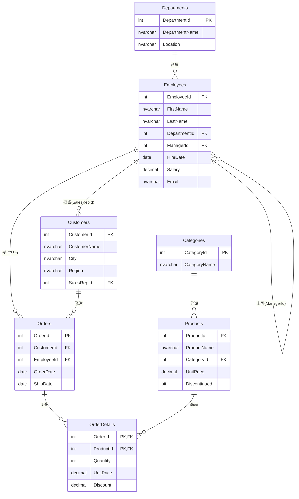

# サンプルデータベース `SalesLearning`

本プロジェクトの演習・仕様解説はすべてこの共通スキーマを題材にします。
小規模な販売管理ドメイン(部門・社員・顧客・商品・注文)を模しており、
JOIN・集計・階層・ウィンドウ関数など主要な T-SQL 機能を一通り練習できるよう設計しています。

## セットアップ

SQL Server に接続し、以下を **順番に** 実行してください。

```sql
-- 1. スキーマ作成 (SalesLearning データベースを作り直します)
:r 01_create_schema.sql
-- 2. サンプルデータ投入
:r 02_seed_data.sql
```

- SSMS / Azure Data Studio では各ファイルを開いて実行するだけです。
- `sqlcmd` では以下のように実行できます。

```bash
sqlcmd -S localhost -U sa -P "<password>" -i 01_create_schema.sql
sqlcmd -S localhost -U sa -P "<password>" -i 02_seed_data.sql
```

> ⚠️ `01_create_schema.sql` は既存の `SalesLearning` データベースを **削除して作り直します**。
> 本番環境では実行しないでください。

## ER 図



## テーブル概要

| テーブル | 説明 | 件数 | 演習で狙うポイント |
|---|---|---:|---|
| `Departments` | 部門マスタ | 5 | 所属社員のいない部門(経理部)で LEFT JOIN / 相関を練習 |
| `Employees` | 社員マスタ | 13 | `ManagerId` の自己参照で自己結合・再帰CTE。`Email`/`DepartmentId` に NULL あり |
| `Categories` | 商品カテゴリ | 5 | 商品との1対多 |
| `Products` | 商品マスタ | 20 | `CategoryId` NULL(未分類)・`Discontinued`(廃番)あり |
| `Customers` | 顧客マスタ | 12 | `SalesRepId` NULL(担当未割当)・注文の無い顧客(ラムダソフト)あり |
| `Orders` | 注文ヘッダ | 20 | `ShipDate` NULL(未出荷)あり。2023〜2024年に分布 |
| `OrderDetails` | 注文明細 | 42 | 複合主キー。`Quantity`・`UnitPrice`・`Discount` で金額計算 |

## 意図的に仕込んだ「引っかけ」

演習で NULL や境界値の扱いを学べるよう、以下を意図的に用意しています。

- **NULL を含む列**: `Employees.Email`(社員8)、`Employees.DepartmentId`(社員13)、
  `Employees.ManagerId`(社員1=社長)、`Customers.SalesRepId`、`Orders.ShipDate`、`Products.CategoryId`
- **子レコードの無い親**: `Departments`=経理部(社員なし)、`Customers`=ラムダソフト(注文なし)
- **フラグ列**: `Products.Discontinued = 1` の廃番商品(USBハブ・ホチキス)
- **金額計算**: 明細の売上 = `Quantity * UnitPrice * (1 - Discount)`

## 売上金額の考え方

明細1行あたりの売上は次式で求めます(演習で頻出)。

```sql
Quantity * UnitPrice * (1 - Discount) AS LineTotal
```

`Discount` は 0.00〜1.00 の割引率です(例: 0.10 = 10%割引)。
